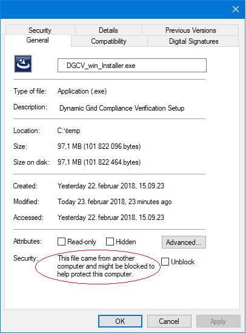
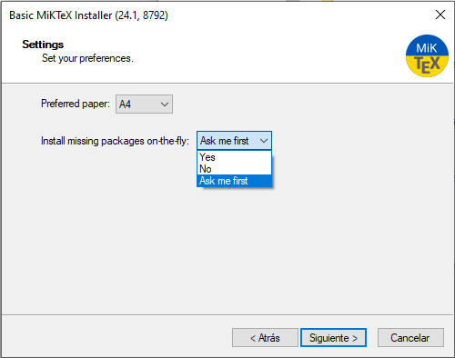

# DyCoV &mdash; a Dynamic grid Compliance Verification tool

[](https://opensource.org/licenses/MPL-2.0)
[](https://dycov.github.io/index.html)

A tool for automating the verification of dynamic grid compliance requirements
for solar, wind, and storage farms (Power Park Modules - PPM) as well as
synchronous machines (SM), including:

  * validation of RMS models (a.k.a. _"phasor models"_) for PPM
  * verification of electric performance requirements for both PPM and SM

The tool is pre-configured to use the tests required by the French connection
network code (i.e., those of RTE's
[DTR](https://www.services-rte.com/files/live//sites/services-rte/files/documentsLibrary/20240729_DTR_5867_fr)
Fiches "I"), but it can be easily configured and extended to run other tests.


(c) 2023&mdash;24 RTE  
Developed by Grupo AIA

--------------------------------------------------------------------------------

#### Table of Contents

1. [Overview](#overview)
2. [DyCoV Installation](#dycov-installation)
3. [Quick start](#quick-start)
4. [Running examples](#running-examples)
5. [Configuration](#configuration)
6. [Compiling Modelica models](#compiling-modelica-models)
7. [Workshop presentation](#workshop-presentation)
8. [For developers](#for-developers)
9. [Roadmap](#roadmap)
10. [Contact](#contact)

--------------------------------------------------------------------------------

# Overview

The **Dynamic grid Compliance Verification** tool (DyCoV for short) is designed
to automate most tasks related to the validation of RMS models, in the context
of compliance requirements for new generation facilities. It contemplates
**model validation** properly speaking (i.e., _"does the model and its
parameterization match the actual behavior?"_), as well as **electric
performance** requirements testing (i.e., _"does the behavior, either measured
or simulated, pass the grid code requirements for connection?"_).

The tool is built with **Python**. Internally it is structured as a series of
independent tests, each producing its own report in PDF. These tests correspond
to the _Fiches I*_ in RTE's DTR document. To be specific, they contain the
following tests:

* **Electric Performance tests (Synchronous Machines)**: Fiches I2 (except
  stability margin calculations), I3, I4, I6, I7, I8, and I10.
* **Electric Performance tests (Power Park Modules)**: Fiches I2, I5, I6, I7, and I10.
* **RMS Model Validation tests (Power Park Modules)**: Fiche I16, structured into:
    - **Zone 1** (converter-level): Fault Ride-Through, Setpoint steps, Grid
      Frequency ramps, and Grid Voltage step.
    - **Zone 3** (plant-level): Voltage Regulation behavior (like I2), Fault
      Ride-Through (like I5), Voltage-dip Ride-Through (like I6), Voltage-swell
      Ride-Through (like I7), and Islanding (like I10).

Correspondingly, the results directory is structured along these lines.

Usually, the inputs are simply three files: the **DYD** and **PAR** files
corresponding to the [Dyna&omega;o](https://github.com/dynawo/dynawo) model on
the producer's side (i.e., everything "left" of the connection point, the PDR
bus), and an **INI** file containing the parameters and metadata that cannot be
provided in the DYD/PAR files. See the available examples in the `examples`
directory, at the top level of the git repository.  For more information about
these files, consult the [User Manual](docs/manual).

Additionally, in the case of _Model Validation_, the user must also provide the
**reference curves** for each test, against which the simulated curves will be
compared. They should be provided as a CSV file and a DICT file that describes
the format.  For more information about these files, consult the [User
Manual](docs/manual).

In the case of _Electric Performance_ testing, the user has also the option of
providing test curves, either to be used _instead of_ Dyna&omega;o simulations,
or to be used along Dyna&omega;o simulations (just for plotting both and
comparing them).

# DyCoV installation

## Linux installation

### System requirements

The requirements at the OS-level are rather minimal: one just needs a recent
Linux distribution in which you should install Dyna&omega;o's requirements, plus
**LaTeX** and **Python**. If you do not have any strong preference, we would
recommend Debian 12 or higher, as well as Ubuntu 22.04 LTS or higher.

To be more specific, we explicitly list here the packages to be installed,
assuming a Debian/Ubuntu system:

* Install the following packages, required by Dyna&omega;o:
  ```bash
  apt install curl unzip gcc g++ cmake
  ```

* Install these LaTeX packages:
  ```bash
   apt install texlive-base texlive-latex-base texlive-latex-recommended \
               texlive-latex-extra texlive-science texlive-lang-french latexmk
  ```

* Install a basic Python installation (version 3.9 or higher), containing at
  least `pip` and the `venv` module:
   ```bash
   apt install python3-minimal python3-pip python3-venv
   ```

* Install git (the current installer relies on building the Python package from
  sources):
   ```bash
   apt install git
   ```

Note that the tool itself is a Python package. However, this package and all of
its dependencies (NumPy, etc.) will get installed at the user-level, i.e.,
inside the user's `$HOME` directory, under a _Python virtual environment_.


### Installation

1. Choose a base directory of your choice and run the following command:

   ```bash
   curl -L https://github.com/dynawo/dyn-grid-compliance-verification/releases/download/v0.9.1/linux_install.sh | bash
   ```

   This script will install the DyCoV tool, together with a matching version of
   Dyna&omega;o, under your current directory in `$PWD/dycov`.  It will do so by
   cloning the latest stable release and building & installing the application
   (and all of its dependencies, such as NumPy, etc.) under a Python virtual
   environment.

2. Next, you must activate the virtual environment that has just been created: 
   ```bash
   source $PWD/dycov/activate_dycov
   ```

3. The tool is used via a single command `dycov` having several subcommands. Quickly
   check that your installation is working by running the help option, which will show
   you all available subcommands:
   ```bash
   dycov -h
   ```

The DyCoV application is now ready to use.


## Windows installation

### Installation

> [!NOTE]  
> The Windows installer described here will install not only the DyCoV tool, but
> also all of the other requirements for you. Read the next section if you are
> interested in the details of what is installed in the Operating System
> (Dynawo, Python, LaTeX).

1. Download the [DyCoV's Windows Installer](https://github.com/dynawo/dyn-grid-compliance-verification/releases/download/v0.8.1/DyCoV_win_Installer.exe).

   In order to install the application, it is essential that the user has administrator rights. If the user is an administrator, there are no problems in unblocking the executable:
   
   

2. Next, execute the downloaded installer:

   This executable will install the DyCoV tool, together with a matching version of Dynawo,
   under the selected directory (default installation path: `c:/dycov`).  It will do this 
   by copying the latest stable version and compiling and installing the application (and 
   all its dependencies, such as NumPy, etc.) into a Python virtual environment. The 
   installer will also install any third-party applications required for the proper 
   functioning of the tool.

    The MikTex installer allows you to select the configuration that you want to apply. 
    For the tool to work correctly, you must select the "Yes" or "Ask me first" option on the 
    following screen:
    


3. Next, you must activate the virtual environment that has just been created by
   double-clicking on the DyCoV.bat file that has been created on the desktop.

   This action will open a new Command Prompt with the virtual environment
   activated where the tool can be used.  To finish using the tool, you only
   need to close the Command Prompt.

4. The tool is used via a single command `dycov` having several subcommands. Quickly
   check that your installation is working by running the help option, which will show
   you all available subcommands:
   ```winbatch
   dycov -h
   ```

The DyCoV application is now ready to use.


### System requirements (for manual installs)

> [!NOTE]  
> The Windows installer (described in the previous section) will install all of
> these system requirements for you. This is only here for your information, in
> case you would rather install any of these components yourself. After you have
> installed all this, you should still use the Windows installer to install the
> DyCoV tool (it will skip installing any of these OS requirements if they are
> already installed).

The requirements of the DyCoV tool at the OS-level are rather minimal: one just
needs a recent Windows distribution in which you should install **Dyna&omega;o**
(and its requirements), **LaTeX**, and **Python**. If you do not have any strong
preference, we would recommend Windows 10 or higher.

To be more specific, we explicitly list here the packages to be installed:

* Install Dyna&omega;o (v1.7.0 or later) and its required packages: Dyna&omega;o
  is a simulation platform required by this tool. Follow the steps outlined in
  the official Dyna&omega;o installation guide at [Dynawo Installation
  Guide](https://dynawo.github.io/install/).
   - **Nightly Version**: Download the **Nightly version** of Dynawo from the
     repository to ensure you have the latest features and updates.

> [!NOTE]  
> On Windows, you can either run Dynaωo with distribution models, in this case, 
> nothing additional is required. But if you want to add new models, you will need:
>   - **CMake**: CMake is used to configure the build process for
>     Dynawo. Download it from [cmake.org](https://cmake.org/download/).
>   - **Build Tools for Visual Studio 2019**: the Visual Studio compiler is
>     required to compile custom Modelica models in Dynawo. You can download
>     the free **Community Edition** of these tools from
>     [here](https://visualstudio.microsoft.com/vs/older-downloads/). During
>     the installation, select only the _"Desktop development with C++"_
>     workload.

* Install LaTeX. You can choose between these two LaTeX distributions:
   - **MiKTeX**: Download it from [MiKTeX Download](https://miktex.org/download).
   - **TeX Live**: Download it from [TeX Live Download](https://www.tug.org/texlive/).

* Install a basic Python installation (version 3.9 or higher), containing at
  least `pip` and the `venv` module:
   - Go to the [official Python website](https://www.python.org/downloads/).
   - Download the latest version of Python 3 (ensure that you select the option
     to add Python to the system PATH during installation).

Note that the DyCoV tool itself is a Python package. However, this package and
all of its dependencies (NumPy, etc.) will get installed under a *Python virtual
environment*.


# Quick start

The tool currently has different entry points, depending on what you want to use
it for:
* For **RMS model** validation: `dycov validate`
* For **electric performance** verification: `dycov performance`


## RMS model validations

In this mode the tool runs a set of _Model Validation tests_.  Some of these
tests resemble those of Fiches I, while some are different.  Of course, here one
is validating the model, not the electric performance; therefore, it is
mandatory to provide _reference curves_ as well as a model or producer curves.


Run the command with option `--help` (or `-h`) to get a quick overview of the
inputs you need to provide:
```
usage: dycov validate [-h] [-d] [-l LAUNCHER_DWO]
                     [-m PRODUCER_MODEL | -c PRODUCER_CURVES] [-p PCS]
                     [-o RESULTS_DIR] [-od]
                     [reference_curves]

positional arguments:
  reference_curves      enter the path to the folder containing the reference
                        curves for the Performance Checking Sheet (PCS)

options:
  -h, --help            show this help message and exit
  -d, --debug           more debug messages
  -l LAUNCHER_DWO, --launcher_dwo LAUNCHER_DWO
                        enter the path to the Dynawo launcher
  -m PRODUCER_MODEL, --producer_model PRODUCER_MODEL
                        enter the path to the folder containing the
                        producer_model files (DYD, PAR, INI)
  -c PRODUCER_CURVES, --producer_curves PRODUCER_CURVES
                        enter the path to the folder containing the curves for
                        the Performance Checking Sheet (PCS)
  -p PCS, --pcs PCS     enter one Performance Checking Sheet (PCS) to validate
  -o RESULTS_DIR, --results_dir RESULTS_DIR
                        enter the path to the results dir
  -od, --only_dtr       validate using only the PCS defined in the DTR
```


## Electric performance verifications

In this mode the tool runs an execution pipeline consisting in a set of
pre-defined tests, those of _Fiches_ "I" in RTE's DTR. You would use the command
`dycov performance` for _Synchronous Machines_ and for
_Power Park Modules_ (i.e. Wind and PV farms).

Run the command with option `--help` (or `-h`) to get a quick overview of the
inputs you need to provide:
```
usage: dycov performance [-h] [-d] [-l LAUNCHER_DWO] [-m PRODUCER_MODEL]
                    [-c PRODUCER_CURVES] [-p PCS] [-o RESULTS_DIR] [-od]

options:
  -h, --help            show this help message and exit
  -d, --debug           more debug messages
  -l LAUNCHER_DWO, --launcher_dwo LAUNCHER_DWO
                        enter the path to the Dynawo launcher
  -m PRODUCER_MODEL, --producer_model PRODUCER_MODEL
                        enter the path to the folder containing the
                        producer_model files (DYD, PAR, INI)
  -c PRODUCER_CURVES, --producer_curves PRODUCER_CURVES
                        enter the path to the folder containing the curves for
                        the Performance Checking Sheet (PCS)
  -p PCS, --pcs PCS     enter one Performance Checking Sheet (PCS) to validate
  -o RESULTS_DIR, --results_dir RESULTS_DIR
                        enter the path to the results dir
  -od, --only_dtr       validate using only the PCS defined in the DTR
```

Note that, in this mode, the tool can perform the electrical performance
verification using either a user-provided Dyna&omega;o **model** (running
Dyna&omega;o simulations), or a set of user-provided **curves**, or both (in
which case the curves are used only for showing them on the graphs, along the
simulated curves). Therefore you must provide either a `PRODUCER_MODEL` or a
`PRODUCER_CURVE` directory, or both.

The options and the required format of INI and curves files are documented in
the tool's [User Manual](docs/manual). For the format of DYD and PAR files (that
is, the Dyna&omega;o model of the producer's facilities), see the [Dyna&omega;o
documentation](https://dynawo.github.io/docs/).


# Running examples

In the `examples` folder (located at the first level inside the cloned
repository) one can find several valid input files that can be used as
examples.

## Model Validation Example:

```
dycov validate $PWD/dycov/examples/Model/Wind/IEC2015/ReferenceCurves -m $PWD/dycov/examples/Model/Wind/IEC2015/Dynawo
```

Upon execution, the screen output should be similar to the
following. Additionally, all results will be generated in a (newly created)
results directory. PDF reports for each kind of test will be found in the 'Reports'
subdirectory within the results' directory. If run with `--debug`, all Dyna&omega;o simulations are
also preserved inside this directory, so that they can be inspected and re-run
for deeper analysis, if desired.

```
2024-10-11 11:27:51,765 |           DyCoV.ModelValidation |       INFO |       model_validation.py:   92 | DyCoV Model Validation
2024-10-11 11:27:51,798 |       DyCoV.Operating Condition |       INFO |    operating_condition.py:  237 | RUNNING BENCHMARK: PCS_RTE-I16z1.ThreePhaseFault, OPER. COND.: TransientBoltedSCR3
2024-10-11 11:27:56,324 |       DyCoV.Operating Condition |       INFO |    operating_condition.py:  237 | RUNNING BENCHMARK: PCS_RTE-I16z1.ThreePhaseFault, OPER. COND.: TransientBoltedSCR10
2024-10-11 11:27:59,540 |       DyCoV.Operating Condition |       INFO |    operating_condition.py:  237 | RUNNING BENCHMARK: PCS_RTE-I16z1.ThreePhaseFault, OPER. COND.: TransientBoltedSCR3Qmin
2024-10-11 11:28:02,960 |       DyCoV.Operating Condition |       INFO |    operating_condition.py:  237 | RUNNING BENCHMARK: PCS_RTE-I16z1.ThreePhaseFault, OPER. COND.: TransientHiZTc800
2024-10-11 11:28:17,388 |       DyCoV.Operating Condition |       INFO |    operating_condition.py:  237 | RUNNING BENCHMARK: PCS_RTE-I16z1.ThreePhaseFault, OPER. COND.: TransientHiZTc500
2024-10-11 11:28:33,459 |       DyCoV.Operating Condition |       INFO |    operating_condition.py:  237 | RUNNING BENCHMARK: PCS_RTE-I16z1.ThreePhaseFault, OPER. COND.: PermanentBolted
2024-10-11 11:28:37,575 |       DyCoV.Operating Condition |       INFO |    operating_condition.py:  237 | RUNNING BENCHMARK: PCS_RTE-I16z1.ThreePhaseFault, OPER. COND.: PermanentHiZ
2024-10-11 11:28:50,476 |       DyCoV.Operating Condition |       INFO |    operating_condition.py:  237 | RUNNING BENCHMARK: PCS_RTE-I16z1.SetPointStep, OPER. COND.: Active
2024-10-11 11:28:54,294 |       DyCoV.Operating Condition |       INFO |    operating_condition.py:  237 | RUNNING BENCHMARK: PCS_RTE-I16z1.SetPointStep, OPER. COND.: Reactive
2024-10-11 11:28:57,550 |       DyCoV.Operating Condition |       INFO |    operating_condition.py:  237 | RUNNING BENCHMARK: PCS_RTE-I16z1.SetPointStep, OPER. COND.: Voltage
2024-10-11 11:28:57,601 |                    DyCoV.Dynawo |    WARNING |       model_parameters.py:  351 | IECWT4BCurrentSource2015 control mode will be changed
2024-10-11 11:29:01,219 |       DyCoV.Operating Condition |       INFO |    operating_condition.py:  237 | RUNNING BENCHMARK: PCS_RTE-I16z1.GridFreqRamp, OPER. COND.: W500mHz250ms
2024-10-11 11:29:04,795 |       DyCoV.Operating Condition |       INFO |    operating_condition.py:  237 | RUNNING BENCHMARK: PCS_RTE-I16z1.GridVoltageStep, OPER. COND.: Rise
2024-10-11 11:29:08,083 |       DyCoV.Operating Condition |       INFO |    operating_condition.py:  237 | RUNNING BENCHMARK: PCS_RTE-I16z1.GridVoltageStep, OPER. COND.: Drop
2024-10-11 11:29:11,629 |       DyCoV.Operating Condition |       INFO |    operating_condition.py:  237 | RUNNING BENCHMARK: PCS_RTE-I16z3.USetPointStep, OPER. COND.: AReactance
2024-10-11 11:29:11,694 |                    DyCoV.Dynawo |    WARNING |       model_parameters.py:  351 | IECWPP4BCurrentSource2015 control mode will be changed
2024-10-11 11:29:15,820 |       DyCoV.Operating Condition |       INFO |    operating_condition.py:  237 | RUNNING BENCHMARK: PCS_RTE-I16z3.USetPointStep, OPER. COND.: BReactance
2024-10-11 11:29:15,871 |                    DyCoV.Dynawo |    WARNING |       model_parameters.py:  351 | IECWPP4BCurrentSource2015 control mode will be changed
2024-10-11 11:29:19,563 |       DyCoV.Operating Condition |       INFO |    operating_condition.py:  237 | RUNNING BENCHMARK: PCS_RTE-I16z3.PSetPointStep, OPER. COND.: Dec40
2024-10-11 11:29:23,539 |       DyCoV.Operating Condition |       INFO |    operating_condition.py:  237 | RUNNING BENCHMARK: PCS_RTE-I16z3.PSetPointStep, OPER. COND.: Inc40
2024-10-11 11:29:27,268 |       DyCoV.Operating Condition |       INFO |    operating_condition.py:  237 | RUNNING BENCHMARK: PCS_RTE-I16z3.QSetPointStep, OPER. COND.: Inc10
2024-10-11 11:29:30,366 |       DyCoV.Operating Condition |       INFO |    operating_condition.py:  237 | RUNNING BENCHMARK: PCS_RTE-I16z3.QSetPointStep, OPER. COND.: Dec20
2024-10-11 11:29:33,440 |       DyCoV.Operating Condition |       INFO |    operating_condition.py:  237 | RUNNING BENCHMARK: PCS_RTE-I16z3.ThreePhaseFault, OPER. COND.: TransientBolted
2024-10-11 11:29:40,400 |       DyCoV.Operating Condition |       INFO |    operating_condition.py:  237 | RUNNING BENCHMARK: PCS_RTE-I16z3.GridVoltageDip, OPER. COND.: Qzero
2024-10-11 11:29:46,410 |       DyCoV.Operating Condition |       INFO |    operating_condition.py:  237 | RUNNING BENCHMARK: PCS_RTE-I16z3.GridVoltageSwell, OPER. COND.: QMax
2024-10-11 11:29:51,451 |       DyCoV.Operating Condition |       INFO |    operating_condition.py:  237 | RUNNING BENCHMARK: PCS_RTE-I16z3.GridVoltageSwell, OPER. COND.: QMin
2024-10-11 11:29:56,347 |       DyCoV.Operating Condition |       INFO |    operating_condition.py:  237 | RUNNING BENCHMARK: PCS_RTE-I16z3.Islanding, OPER. COND.: DeltaP10DeltaQ4
2024-10-11 11:29:58,116 |                    DyCoV.Dynawo |    WARNING |              simulator.py:  892 | Simulation Fails, logs in Results/Model/PCS_RTE-I16z3/Islanding/DeltaP10DeltaQ4/outputs/logs/dynawo.log
2024-10-11 11:30:47,926 |                  DyCoV.PDFLatex |    WARNING |                 figure.py:  507 | All curves appear to be flat in PCS_RTE-I16z1.GridFreqRamp.W500mHz250ms; something must be wrong with the simulation
2024-10-11 11:31:46,592 |                    DyCoV.Report |       INFO |                 report.py:  273 | 
Summary Report
==============

***Run on 2024-10-11 11:31 CEST***
***Dynawo version: 1.7.0 (rev:master-4ee311a)***
***Model: examples/Model/Wind/IEC2015/Dynawo***
***Reference: examples/Model/Wind/IEC2015/ReferenceCurves***


Pcs          Benchmark                Operating Condition      Overall Result
-----------------------------------------------------------------------------
PCS_RTE-I16z1ThreePhaseFault          TransientBoltedSCR3      Compliant
PCS_RTE-I16z1ThreePhaseFault          TransientBoltedSCR10     Compliant
PCS_RTE-I16z1ThreePhaseFault          TransientBoltedSCR3Qmin  Compliant
PCS_RTE-I16z1ThreePhaseFault          TransientHiZTc800        Compliant
PCS_RTE-I16z1ThreePhaseFault          TransientHiZTc500        Compliant
PCS_RTE-I16z1ThreePhaseFault          PermanentBolted          Compliant
PCS_RTE-I16z1ThreePhaseFault          PermanentHiZ             Compliant
PCS_RTE-I16z1SetPointStep             Active                   Non-compliant
PCS_RTE-I16z1SetPointStep             Reactive                 Compliant
PCS_RTE-I16z1SetPointStep             Voltage                  Non-compliant
PCS_RTE-I16z1GridFreqRamp             W500mHz250ms             Non-compliant
PCS_RTE-I16z1GridVoltageStep          Rise                     Non-compliant
PCS_RTE-I16z1GridVoltageStep          Drop                     Non-compliant
PCS_RTE-I16z3USetPointStep            AReactance               Non-compliant
PCS_RTE-I16z3USetPointStep            BReactance               Non-compliant
PCS_RTE-I16z3PSetPointStep            Dec40                    Compliant
PCS_RTE-I16z3PSetPointStep            Inc40                    Compliant
PCS_RTE-I16z3QSetPointStep            Inc10                    Compliant
PCS_RTE-I16z3QSetPointStep            Dec20                    Non-compliant
PCS_RTE-I16z3ThreePhaseFault          TransientBolted          Compliant
PCS_RTE-I16z3GridVoltageDip           Qzero                    Compliant
PCS_RTE-I16z3GridVoltageSwell         QMax                     Compliant
PCS_RTE-I16z3GridVoltageSwell         QMin                     Compliant
PCS_RTE-I16z3Islanding                DeltaP10DeltaQ4          Failed simulation


2024-10-11 11:32:17,921 |                  DyCoV.PDFLatex |       INFO |                 report.py:  414 | PDF done: /tmp/DyCoV_Results_debian/0b738550-9d10-4ead-bfc5-e03cc2bcaee5/Reports/report.tex
2024-10-11 11:32:36,547 |           DyCoV.ModelValidation |       INFO |       model_validation.py:   40 | Opening the report: Results/Model/Reports/report.pdf
Opening in existing browser session.
```

## Electrical Performance Example:

```
dycov performance -m $PWD/dycov/examples/SM/Dynawo/SingleAux
```

Upon execution, the screen output should be similar to the
following. Additionally, all results will be generated in a (newly created)
results directory. PDF reports for each kind of test will be found in the 'Reports'
subdirectory within the results' directory. If run with `--debug`, all Dyna&omega;o simulations are
also preserved inside this directory, so that they can be inspected and re-run
for deeper analysis, if desired.

```
2024-10-11 11:34:29,199 |           DyCoV.ModelValidation |       INFO |       model_validation.py:   76 | Electric Performance Verification for Synchronous Machines
2024-10-11 11:34:29,232 |       DyCoV.Operating Condition |       INFO |    operating_condition.py:  237 | RUNNING BENCHMARK: PCS_RTE-I2.USetPointStep, OPER. COND.: AReactance
2024-10-11 11:34:29,766 |       DyCoV.Operating Condition |       INFO |    operating_condition.py:  237 | RUNNING BENCHMARK: PCS_RTE-I2.USetPointStep, OPER. COND.: BReactance
2024-10-11 11:34:30,215 |       DyCoV.Operating Condition |       INFO |    operating_condition.py:  237 | RUNNING BENCHMARK: PCS_RTE-I3.LineTrip, OPER. COND.: 2BReactance
2024-10-11 11:34:30,828 |       DyCoV.Operating Condition |       INFO |    operating_condition.py:  237 | RUNNING BENCHMARK: PCS_RTE-I4.ThreePhaseFault, OPER. COND.: TransientBolted
2024-10-11 11:34:41,351 |       DyCoV.Operating Condition |       INFO |    operating_condition.py:  237 | RUNNING BENCHMARK: PCS_RTE-I6.GridVoltageDip, OPER. COND.: Qzero
2024-10-11 11:34:42,511 |       DyCoV.Operating Condition |       INFO |    operating_condition.py:  237 | RUNNING BENCHMARK: PCS_RTE-I7.GridVoltageSwell, OPER. COND.: QMax
2024-10-11 11:34:43,523 |       DyCoV.Operating Condition |       INFO |    operating_condition.py:  237 | RUNNING BENCHMARK: PCS_RTE-I7.GridVoltageSwell, OPER. COND.: QMin
2024-10-11 11:34:44,482 |       DyCoV.Operating Condition |       INFO |    operating_condition.py:  237 | RUNNING BENCHMARK: PCS_RTE-I8.LoadShedDisturbance, OPER. COND.: PmaxQzero
2024-10-11 11:34:44,925 |       DyCoV.Operating Condition |       INFO |    operating_condition.py:  237 | RUNNING BENCHMARK: PCS_RTE-I10.Islanding, OPER. COND.: DeltaP10DeltaQ4
2024-10-11 11:34:57,351 |                    DyCoV.Report |       INFO |                 report.py:  273 | 
Summary Report
==============

***Run on 2024-10-11 11:34 CEST***
***Dynawo version: 1.7.0 (rev:master-4ee311a)***
***Model: examples/SM/Dynawo/SingleAux***


Pcs          Benchmark                Operating Condition      Overall Result
-----------------------------------------------------------------------------
PCS_RTE-I2   USetPointStep            AReactance               Non-compliant
PCS_RTE-I2   USetPointStep            BReactance               Non-compliant
PCS_RTE-I3   LineTrip                 2BReactance              Compliant
PCS_RTE-I4   ThreePhaseFault          TransientBolted          Compliant
PCS_RTE-I6   GridVoltageDip           Qzero                    Compliant
PCS_RTE-I7   GridVoltageSwell         QMax                     Compliant
PCS_RTE-I7   GridVoltageSwell         QMin                     Compliant
PCS_RTE-I8   LoadShedDisturbance      PmaxQzero                Compliant
PCS_RTE-I10  Islanding                DeltaP10DeltaQ4          Compliant


2024-10-11 11:35:08,635 |                  DyCoV.PDFLatex |       INFO |                 report.py:  414 | PDF done: /tmp/DyCoV_Results_debian/e66c17ee-caff-4ef1-ae1f-eba5592092bb/Reports/report.tex
2024-10-11 11:35:08,797 |           DyCoV.ModelValidation |       INFO |       model_validation.py:   40 | Opening the report: Results/Performance/Reports/report.pdf
Opening in existing browser session.
```


# Configuration

The tool is configured via a `config.ini` file, written in the well-known INI
format (of the [Python
flavor](https://docs.python.org/3/library/configparser.html)). The location of
this file follows the customary standard of each platform for application data:

* Under Linux: `$HOME/.config/dycov/`
* Under Windows: `%APPDATA%\Local\dycov`

The supplied INI file contains just the options that most users of the tool
would want to change, but there exist many more internal configuration options
that may be overriden in this INI file.  For more information about
configuration, including more advanced tasks such as adding a whole new test,
consult the [User Manual](docs/manual).


# Workshop presentation
Here you can watch the video of the presentation workshop held on 11/03/2025. (english subtitles available only if you download the video)
Part 1: 

https://github.com/user-attachments/assets/d8c0bcd8-339f-47e4-9f26-e452b2e87980

Part 2:

https://github.com/user-attachments/assets/ff219478-f3d2-4790-bc45-39a11e227b5b


# For developers

## Build and install on Linux (using uv)

1.  Clone the repository:
    ```bash
    git clone [https://github.com/dynawo/dyn-grid-compliance-verification](https://github.com/dynawo/dyn-grid-compliance-verification) dycov_repo
    cd dycov_repo
    ```

2.  Ensure you have `uv` installed. If not, you can install it via pipx (recommended) or pip:
    ```bash
    # With pipx
    pipx install uv

    # Or with pip
    pip install uv
    ```

3.  Create a virtual environment and install the package in editable mode with all development dependencies.
    ```bash
    # Create the virtual environment (named dycov_venv for consistency)
    uv venv dycov_venv

    # Activate the environment
    source dycov_venv/bin/activate

    # Install the package and all dev/test dependencies
    uv pip install -e .[dev,test]
    ```
    *Alternatively, you can run the simplified `build_and_install.sh` script which automates these steps.*

4.  Quickly check that your installation is working by running the help option:
    ```bash
    dycov -h
    ```

5.  Compile the internal Modelica models. This is required on first use.
    ```bash
    dycov compile
    ```
   
The DyCoV application is now ready for development.

## Build and install on Windows (using uv)

1.  Clone the Repository using your favorite Git client (e.g., GitHub Desktop or `git-scm`).
    ```bash
    git clone [https://github.com/dynawo/dyn-grid-compliance-verification](https://github.com/dynawo/dyn-grid-compliance-verification) dycov_repo
    cd dycov_repo
    ```

2.  Ensure you have `uv` installed. You can install it via pip:
    ```bash
    pip install uv
    ```

3.  Set up the virtual environment and install dependencies.
    - Open a **CMD terminal** or **PowerShell**.
    - Navigate to the root folder of the cloned repository.
    - Create a new virtual environment:
      ```batch
      uv venv dycov_venv
      ```
    - Activate the virtual environment:
      ```batch
      dycov_venv\Scripts\activate
      ```
    - Install the package in editable mode with all development and test dependencies:
      ```batch
      uv pip install -e .[dev,test]
      ```

4.  Verify Installation. This should display the help message for the tool.
    ```batch
    dycov -h
    ```

5.  Pre-Execution Compilation. Before running the tool for the first time, compile the tool's resources:
    ```batch
    dycov compile
    ```

The DyCoV application is now ready for development.

Finally, if you want to further _develop_ the source code of this tool, consult
the [Developer Manual](docs/manual_dev).

## DyCoV flowchart

Below is the DyCoV flowchart. This diagram is not intended to show all the details of the tool, but rather to facilitate understanding of its main flow.


# Roadmap

Below are the major development axis identified for DyCoV in the next few months with associated contents. It is important to notice that the development content may be subject to change due to unforeseen complexity in implementing features or priority changes.

## Axis 1 - Models support

* Complete support of WECC PV and BESS models
* Support of IEC 63426 standard model ("Generic RMS simulations models of converter-based generating units")

## Axis 2 - Ease of use

* Analysis and report improvements
* Tutorials
* Addition of a Graphical User Interface
* Windows portability

## Axis 3 - Tool performance, quality and robustness

* Consolidation of the signal processing part
* Robustness improvements
* Inclusion of on-site verification for RMS model validation

# Contact

For any questions or feedback, please reach out to the appropriate contact below:
* For inquiries related to electrical modeling, please contact RTE at: rte-r-d-raccordement@rte-france.com
* For any software-related issues or questions, please contact AIA at: dycov@aia.es

