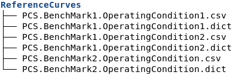
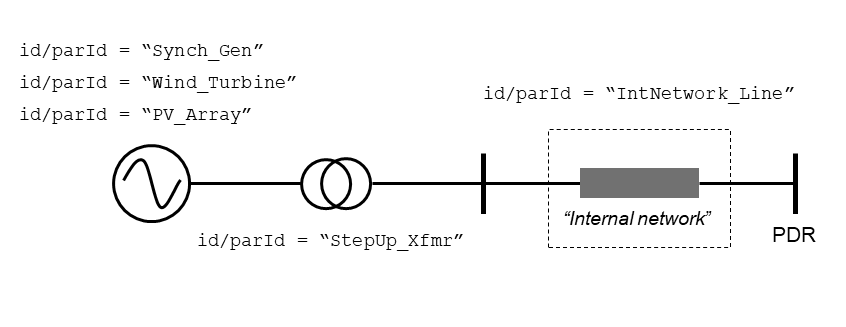
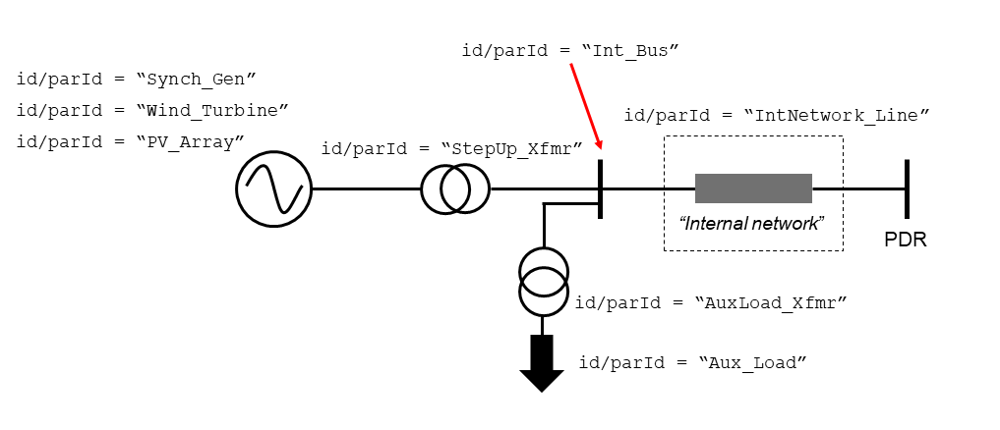
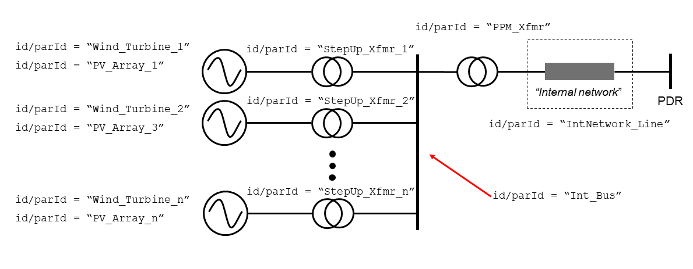
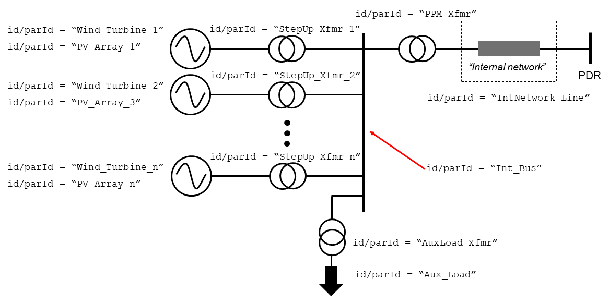

======
Inputs
======

Overview
--------

Usually, the inputs are simply three files: the **DYD** and **PAR** files
corresponding to the Dynawo model on the producer's side (i.e., everything
"left" of the connection point, the PDR bus), and an **INI** file containing the
certain parameters and metadata that cannot be provided in the DYD/PAR
files. It is also possible to provide a set of curves as input to the tool, these
should be provided as a file in one of the accepted formats plus a
special DICT file that describes the format (see :ref:`Producer Curves <producerCurves>` below).
See the available examples in the `examples` directory, at the top level of the git repository.

Additionally, in the case of *RMS Model Validation*, the user must also provide the
**reference curves** for each test, against which the simulated curves will be
compared. They should be provided as a file in one of the accepted formats plus a
special DICT file that describes the format (see :ref:`Reference Curves <referenceCurves>`
below).

In the case of *Electric Performance* testing, the user also has the option of providing
test curves to be used along Dynawo simulations (just for plotting both and comparing them).

Producer Model
--------------

The *Producer Model* is built using 3 files: **DYD**, **PAR**, and **INI**. The **DYD**
and **PAR** files correspond to the Dynawo model on the producer side, using these files
one of the topologies accepted by the tool is generated (see :ref:`available topologies
<topologies>`). The **DYD** file expresses the models and connectivity of the Producer's
side, meaning everything to the "left hand side" of the connection to the transmission
grid (TSO's grid being on the "right hand side", in this symbolic picture).  This
connection point is represented by a bus called 'busPDR'. This bus should *not* be
defined in the *Producer Model*, since it is already defined in the **DYD** files that
the tool uses internally to represent the grid's side. Therefore the *Producer Model*
should only express the connections between the aforementioned bus and the production
plant equipment. The **PAR** file is where all the equipment modeled in the **DYD** file
should be parameterized. Finally, the **INI** file contains some parameters and
information that is specifically required by the tool and that cannot be provided by
Dynawo's **DYD** / **PAR** files (see `Dynawo documentation`__ for more info about
Dynawo).

When running one of the *Electric Performance* testing commands to validate a given
*Producer Model* (synchronous generators or PPMs), the user must indicate the directory
where these 3 model files are located.

However, when running the *RMS Model Validation* command, the user must indicate a
directory containing **two** Dynawo models, each in its own subfolder, respectively
named 'Zone1' and 'Zone3'.  The Zone 1 model should represent a single production unit,
such as a Wind Turbine. The Zone 3 model should represent the whole wind farm (i.e. the
PPM plant), although in this case multiple generating units of the same kind should be
represented by one equivalent unit.  For more details, see the definition of these zones
in the DTR documentation, in PCS I16.

__ https://dynawo.github.io/

.. _gfm_producer_input:

GFM Producer Input (.ini file)
^^^^^^^^^^^^^^^^^^^^^^^^^^^^^^

The ``dycov generateEnvelopes`` command requires a dedicated ``.ini`` file that specifies the characteristics of the Grid-Forming asset. This file must contain two main sections: ``[DEFAULT]`` for general parameters and ``[GFM Parameters]`` for the core GFM constants.

Here is an example of a valid GFM producer file:

.. code-block:: ini
   :caption: Example GFM Producer INI File

   [DEFAULT]
   # Nominal voltage at the PDR Bus (in kV)
   Unom = 20.0
   # Maximum active power injection of the unit (in MW)
   p_max_injection = 100.0
   # Minimum active power injection of the unit (in MW)
   p_min_injection = 0.0
   # Maximum reactive power capability (in MVar)
   q_max = 50.0
   # Minimum reactive power capability (in MVar)
   q_min = -50.0

   [GFM Parameters]
   # Damping constant (unitless or in pu)
   D = 20.0
   # Inertia constant (in seconds)
   H = 3.5
   # Effective reactance from the inverter to the PDR (in pu)
   Xeff = 0.15
   # Nominal apparent power of the GFM unit (in MVA)
   Snom = 110.0

Supported Dynamic Models
^^^^^^^^^^^^^^^^^^^^^^^^

Dynawo is a dynamic network simulator with a wide variety of models implementing the
different equipment of a power transmission grid. Each of these models has his own
collection of *parameters* (initialization, control, electric characteristics, etc.).

Due to the huge variety of Dynawo models and model parameters, the names of those Dynawo
parameters vary wildly, even when they refer conceptually to the same thing. Take for
instance something quite common, such as the setpoint of the voltage regulation of a
generating unit (of any kind). The Dynawo name for this parameter is
``voltageRegulator_UsRefPu`` in the case of synchronous generators,
``WTG4A_wecc_repc_URefPu`` or ``WTG4B_wecc_repc_URefPu`` in the case of WECC wind farm
models, ``WPP_xWPRefPu`` in the case of IEC models, etc. Therefore the tool has to
maintain an internal "master dictionary" that maps these different names to a common
name, thanks to which the parameters can be identified and be read or written by the
tool. For instance, in the example given all these names map to a common name
``AVRSetpointPu``.

This is internal and the user does not need to be concerned with this translation, but
it means that **in order to support a new Dynawo model (or an updated one), this
internal dictionary must be updated**. See the Developer Manual for the details on how
to do this.

Currently supported models:

* Bus:
    * InfiniteBus
        Bus whose voltage magnitude and angle remains constant throughout the simulation
    * InfiniteBusFromTable
        Infinite bus with UPu, UPhase and omegaRefPu given by tables as functions of time
    * Bus
        Default bus model (just an electric node)
* Synchronous generators:
    * GeneratorSynchronousFourWindingsGoverPropVRPropInt
        Machine with four windings, a proportional governor on mechanical power and a
        proportional integral excitation voltage regulator
    * GeneratorSynchronousFourWindingsProportionalRegulations
        Machine with four windings, a proportional governor on mechanical power and a
        proportional excitation voltage regulator
    * GeneratorSynchronousFourWindingsTGov1Sexs
        Machine with four windings and standard IEEE regulations - TGov1, SEXS
    * GeneratorSynchronousFourWindingsTGov1SexsPss2a
        Machine with four windings and standard IEEE regulations - TGov1, SEXS and PSS2A
    * GeneratorSynchronousFourWindingsVRKundur
        Machine with four windings, fixed mechanical power and a Kundur proportional voltage
        regulator with no power system stabilizer
    * GeneratorSynchronousFourWindingsVRKundurPssKundur
        Machine with four windings, fixed mechanical power and a Kundur proportional voltage
        regulator with a power system stabilizer
    * GeneratorSynchronousThreeWindingsGoverPropVRPropInt
        Machine with three windings, a proportional governor on mechanical power and a
        proportional integral excitation voltage regulator
    * GeneratorSynchronousThreeWindingsProportionalRegulations
        Machine with three windings, a proportional governor on mechanical power and a
        proportional excitation voltage regulator
    * GeneratorSynchronousThreeWindingsDTRI8
        Ad-hoc machine model for the I8 PCS
* WECC Wind models:
    * WTG4AWeccCurrentSource1
        WECC Wind Turbine model with a simplified drive train model (dual-mass model) and with a
        current source as interface with the grid
    * WTG4BWeccCurrentSource
        WECC Wind Turbine model with a current source as interface with the grid
    * WT4AWeccCurrentSource
        WECC Wind Turbine model with a simplified drive train model (dual-mass model), without the
        plant controller and with a current source as interface with the grid
    * WT4BWeccCurrentSource
        WECC Wind Turbine model without the plant controller and with a current source as interface
        with the grid
* IEC Wind models:
    * IECWPP4ACurrentSource2015
        Wind Power Plant Type 4A model from IEC 61400-27-1:2015 standard : WT4A 2015 and plant controller
        (P/f control module, Q/V control module)
    * IECWPP4BCurrentSource2015
        Wind Power Plant Type 4B model from IEC 61400-27-1:2015 standard : WT4B 2015 and plant controller
        (P/f control module, Q/V control module)
    * IECWPP4ACurrentSource2020
        Wind Power Plant Type 4A model from IEC 61400-27-1:2020 standard : WT4A 2020, plant controller
        (P/f control module, Q/V control module) and communication modules
    * IECWPP4BCurrentSource2020
        Wind Power Plant Type 4B model from IEC 61400-27-1:2020 standard : WT4B 2020, plant controller
        (P/f control module, Q/V control module) and communication modules
    * IECWT4ACurrentSource2015
        Wind Turbine Type 4A model from IEC 61400-27-1:2015 standard : measurement, PLL, protection,
        PControl, QControl, limiters, electrical and generator modules
    * IECWT4BCurrentSource2015
        Wind Turbine Type 4B model from IEC 61400-27-1:2015 standard : measurement, PLL, protection,
        PControl, QControl, limiters, electrical, generator and mechanical modules
    * IECWT4ACurrentSource2020
        Wind Turbine Type 4A model from IEC 61400-27-1:2020 standard : measurement, PLL, protection,
        PControl, QControl, limiters, electrical and generator modules
    * IECWT4BCurrentSource2020
        Wind Turbine Type 4B model from IEC 61400-27-1:2020 standard : measurement, PLL, protection,
        PControl, QControl, limiters, electrical, generator and mechanical modules
* WECC Storage models:
    * BESSWeccCurrentSource
        WECC Storage model
    * BESSWeccCurrentSourceNoPlantControl
        WECC Storage model without the plant controller
* Lines:
    * Line
        AC power line - PI model
* Loads:
    * LoadAlphaBeta
        Load with voltage-dependent active and reactive power (alpha-beta model)
    * LoadPQ
        Load with constant reactive/active power
* Transformers:
    * TransformerFixedRatio
        Two winding transformer with a fixed ratio
    * TransformerPhaseTapChanger
        Two winding transformer with a fixed ratio and variable phase
    * TransformerRatioTapChanger
        Two winding transformer with a fixed phase and variable ratio

.. _referenceCurves:

Reference Curves
----------------

For **RMS Model Validation**, the user must provide the reference curves. The reference curves
are a set of files like the one shown in this example:

    Reference curves structure

The example in this image shows what the reference curves would look like for a *PCS*
with 2 *Benchmarks*, where 'Benchmark1' has 2 *Operating Conditions* and 'Benchmark2'
has only 1 *Operating Conditions*. It is also observed how each producer curve is made
up of 2 files, the producer signals file (in the image in **CSV** format), and a **DICT**
file.

Reference signals are normally of EMT-type, obtained either from real field tests or
from an EMT simulator. But they could also be RMS signals, obtained from a phasor
simulation tool. For this reason, the tool can import producer signal in the following
formats:

* COMTRADE:
    All versions of the COMTRADE standard up to version C37.111-2013 are admissible. The
    signals can be provided either as a single file in the SBB format, or as a pair of
    files in DAT+CFG formats (the two files must in this case have the same name and
    differ only by their extension).
* EUROSTAG:
    Only the EXP ASCII format is supported.
* CSV:
    The column separator must be ";". A "time" column is required, although it does not
    need to be the first column (see the DICT file below).

    The nature of the records must be specified as follows.

In addition, **it is mandatory to provide a companion 'DICT' file, regardless of the
format of the producer signal file**. This dictionary file must have the same filename,
but with the .DICT extension. This file provides two types of information that are
otherwise impossible to guess:

* The correspondence between the columns of the file and the quantities expected in the PCSs.
* Certain simulation parameters used to obtain the curves (depending on the PCS).

The DICT file must be written in "INI" format. More precisely, this file is interpreted
using the module ``configparser`` from the standard Python library. The precise
syntax is documented in the `Supported ini file structure`__ document.

__ https://docs.python.org/3/library/configparser.html#supported-ini-file-structure

.. _producerCurves:

Producer Curves
---------------

Producer curves, as in the Reference Curves, are a set of files, where each reference curve is made up of 2 files,
the reference signals file (in the image in **CSV** format), and a **DICT** file. See
:ref:`Reference Curves <referenceCurves>` for more details on curves files.

In the case of *Electric Performance* PCSs, it is possible to provide a set of
producer curves. If curves are provided and Dynawo models are not, then the tests are
carried out using the curves, and no Dynawo simulations are run. However, when the user
provides both the Dynawo model and producer curves, the curves will only used to show
them in the graphs of the final report, along with the ones simulated by Dynawo (the
tests will use the Dynawo curves).  The structure of the curves directory is identical
to the case of *RMS Model Validation* tests.

.. _topologies:

Available Topologies
--------------------

Currently *Dynamic grid Compliance Verification* is limited to 8 different topologies to represent the
*Producer Model*:

    S and S+i topologies

* S
    single :abbr:`gen (generator)`/:abbr:`WT (Wind Turbine)`/:abbr:`PV (Photovoltaic Array)`
* S+i
    single :abbr:`gen (generator)`/:abbr:`WT (Wind Turbine)`/:abbr:`PV (Photovoltaic Array)` + Internal Network Line

    S+Aux and S+Aux+i topologies

* S+Aux
    single :abbr:`gen (generator)`/:abbr:`WT (Wind Turbine)`/:abbr:`PV (Photovoltaic Array)` + Auxiliary Load
* S+Aux+i
    single :abbr:`gen (generator)`/:abbr:`WT (Wind Turbine)`/:abbr:`PV (Photovoltaic Array)` + Auxiliary Load + Internal Network Line

    M and M+i topologies

* M
    multiple :abbr:`WT (Wind Turbine)`/:abbr:`PV (Photovoltaic Array)`
* M+i
    multiple :abbr:`WT (Wind Turbine)`/:abbr:`PV (Photovoltaic Array)` + Internal Network Line

    M+Aux and M+Aux+i topologies

* M+Aux
    multiple :abbr:`WT (Wind Turbine)`/:abbr:`PV (Photovoltaic Array)` + Auxiliary Load
* M+Aux+i
    multiple :abbr:`WT (Wind Turbine)`/:abbr:`PV (Photovoltaic Array)` + Auxiliary Load + Internal Network Line

.. note::
    For Zone 1 :abbr:`WT (Wind Turbine)`/:abbr:`PV (Photovoltaic Array)` the only one allowed is "S"

    .. figure:: figs_topologies/zone1.png
        :width: 500px

        S Topology

Generating input files
----------------------

The tool has a guided process that allows the user to create all the input files necessary to model
the network on the producer side using Dynawo models. Additionally, the **DICT** files
necessary to generate sets of input curves that can be used as
:ref:`Producer Curves <producerCurves>` and/or :ref:`Reference Curves <referenceCurves>` are
generated.

This process creates an output directory with the input files required by the tool for the
selected verification method. Initially, the process starts with empty template files that the
tool will complete with the help of the user.

The first file that the tool will work on is the **DYD** file, creating the equipment and
connections necessary to implement the topology selected by the user. The generated file must be
edited by the user, modifying the placeholders present in the file for the dynamic model that he
wishes to use among all the models available in the tool. The same file includes in comments the
dynamic models available for each placeholder used when generating the topology. Upon completion
of editing the **DYD** file, the user must press Enter to continue the process. At that time, the
tool will check that the edited file is correct, notifying the user if there are any errors in it.

.. code-block:: console

            <?xml version='1.0' encoding='UTF-8'?>
            <dyn:dynamicModelsArchitecture xmlns:dyn="http://www.rte-france.com/dynawo">
              <!--Topology: S+Aux-->
              <dyn:blackBoxModel id="AuxLoad_Xfmr" lib="XFMR_DYNAMIC_MODEL" parFile="Producer.par" parId="AuxLoad_Xfmr"/>
              <dyn:blackBoxModel id="Aux_Load" lib="LOAD_DYNAMIC_MODEL" parFile="Producer.par" parId="Aux_Load"/>
              <dyn:blackBoxModel id="StepUp_Xfmr" lib="XFMR_DYNAMIC_MODEL" parFile="Producer.par" parId="StepUp_Xfmr"/>
              <dyn:blackBoxModel id="Synch_Gen" lib="SM_DYNAMIC_MODEL" parFile="Producer.par" parId="Synch_Gen"/>
              <dyn:connect id1="AuxLoad_Xfmr" var1="transformer_terminal1" id2="BusPDR" var2="bus_terminal"/>
              <dyn:connect id1="StepUp_Xfmr" var1="transformer_terminal1" id2="BusPDR" var2="bus_terminal"/>
              <dyn:connect id1="Aux_Load" var1="load_terminal" id2="AuxLoad_Xfmr" var2="transformer_terminal2"/>
              <dyn:connect id1="Synch_Gen" var1="generator_terminal" id2="StepUp_Xfmr" var2="transformer_terminal2"/>
              <!--Replace the placeholder: 'XFMR_DYNAMIC_MODEL', available_options: ['TransformerFixedRatio', 'TransformerPhaseTapChanger', 'TransformerRatioTapChanger']-->
              <!--Replace the placeholder: 'SM_DYNAMIC_MODEL', available_options: ['GeneratorSynchronousFourWindingsTGov1SexsPss2a', 'GeneratorSynchronousThreeWindingsDTRI8']-->
              <!--Replace the placeholder: 'LOAD_DYNAMIC_MODEL', available_options: ['LoadPQ','LoadAlphaBeta']-->
            </dyn:dynamicModelsArchitecture>

The next file that the tool will work on is the **PAR** file, generating all the parameters needed
to complete the dynamic models selected by the user in the **DYD** file. The parameters in the
**PAR** file are ordered to first show all the parameters that do not have a default value
assigned, and therefore require the user to complete them. Next, the parameters with default
values are shown. In these parameters, the default value has been used when generating the **PAR**
file, so the user only needs to edit them in case the equipment to be modeled has a different
value. Upon completion of editing the **PAR** file, the user must press Enter to continue the
process. At that time, the tool will check that the edited file is correct, notifying the user if
there are any errors in it.

.. code-block:: console

            <?xml version='1.0' encoding='UTF-8'?>
            <parametersSet xmlns="http://www.rte-france.com/dynawo">
              <set id="AuxLoad_Xfmr">
                <par type="DOUBLE" name="transformer_BPu" value=""/>
                <par type="DOUBLE" name="transformer_GPu" value=""/>
                <par type="DOUBLE" name="transformer_RPu" value=""/>
                <par type="DOUBLE" name="transformer_XPu" value=""/>
                <par type="DOUBLE" name="transformer_rTfoPu" value=""/>
                <par type="INT" name="transformer_NbSwitchOffSignals" value="2"/>
                <par type="INT" name="transformer_State0" value="2"/>
                <par type="BOOL" name="transformer_SwitchOffSignal10" value="false"/>
                <par type="BOOL" name="transformer_SwitchOffSignal20" value="false"/>
                <par type="BOOL" name="transformer_SwitchOffSignal30" value="false"/>
              </set>
            </parametersSet>

To finish modeling the producer's network, the tool will edit the **INI** file to complete the
topology that has been selected, with the user being responsible for completing the parameters
that make up the file. Upon completion of editing the **INI** file, the user must press Enter to
continue the process. At that time, the tool will check that the edited file is correct, notifying
the user if there are any errors in it.

.. code-block:: console

            # p_{max_unite} as defined by the DTR in MW
            p_max =
            # u_nom is the nominal voltage in the PDR Bus (in kV)
            # Allowed values: 400, 225, 150, 90, 63 (land) and 132, 66 (offshore)
            u_nom =
            # s_nom is the nominal apparent power of all generating units (in MVA)
            # This is the value that will be used for the base conversion in the PDR bus active/reactive power
            s_nom =
            # q_max is the maximum reactive power of the generator unit (in MVar)
            q_max =
            # q_min is the minimum reactive power of the generator unit (in MVar)
            q_min =
            # topology
            topology = S+Aux

The last stage of the process is to generate a set of curves for the selected verification. Along
with the model files created, the tool has created a directory called ReferenceCurves. This file
contains a **DICT** file for each test that makes up the verification, as well as an **INI** file
that allows the files containing the user's curves to be related to the relevant test. The user
must edit the **INI** file to provide the path to the file with the curves that the tool should
use, as well as select the columns to verify. Upon completion of editing the **INI** file, the user
must press Enter to continue the process. At that time, the tool will check that the edited file is
correct, notifying the user if there are any errors in it, and that the paths to the curve files
are correct.

.. code-block:: console

            [Curves-Files]
            PCS_RTE-I2.USetPointStep.AReactance =
            PCS_RTE-I2.USetPointStep.BReactance =
            PCS_RTE-I3.LineTrip.2BReactance =
            PCS_RTE-I4.ThreePhaseFault.TransientBolted =
            PCS_RTE-I6.GridVoltageDip.Qzero =
            PCS_RTE-I7.GridVoltageSwell.QMax =
            PCS_RTE-I7.GridVoltageSwell.QMin =
            PCS_RTE-I8.LoadShedDisturbance.PmaxQzero =
            PCS_RTE-I10.Islanding.DeltaP10DeltaQ4 =

            [Curves-Dictionary]
            time =
            BusPDR_BUS_Voltage =
            BusPDR_BUS_ActivePower =
            BusPDR_BUS_ReactivePower =
            StepUp_Xfmr_XFMR_Tap =
            Synch_Gen_GEN_RotorSpeedPu =
            Synch_Gen_GEN_InternalAngle =
            Synch_Gen_GEN_AVRSetpointPu =
            Synch_Gen_GEN_MagnitudeControlledByAVRP =
            Synch_Gen_GEN_NetworkFrequencyPu =
            # To represent a signal that is in raw abc three-phase form, the affected signal must be tripled
            # and the suffixes _a, _b and _c must be added as in the following example:
            #    BusPDR_BUS_Voltage_a =
            #    BusPDR_BUS_Voltage_b =
            #    BusPDR_BUS_Voltage_c =
