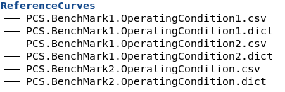
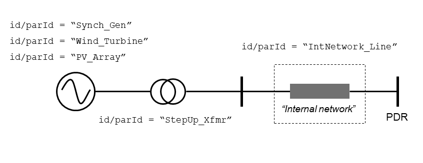
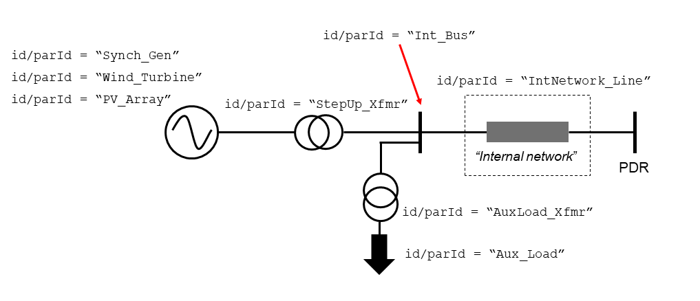
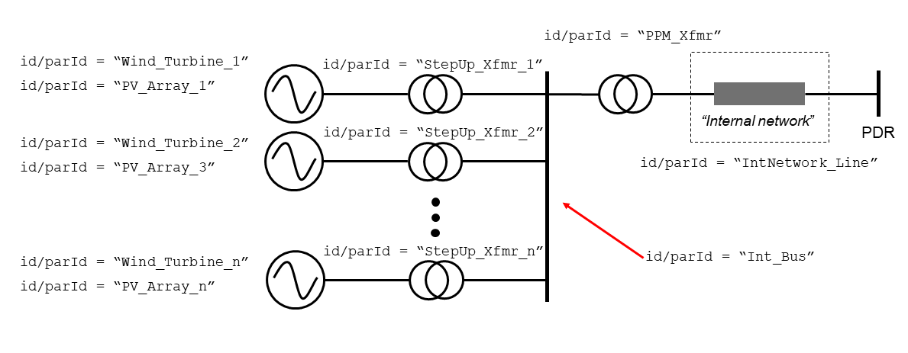
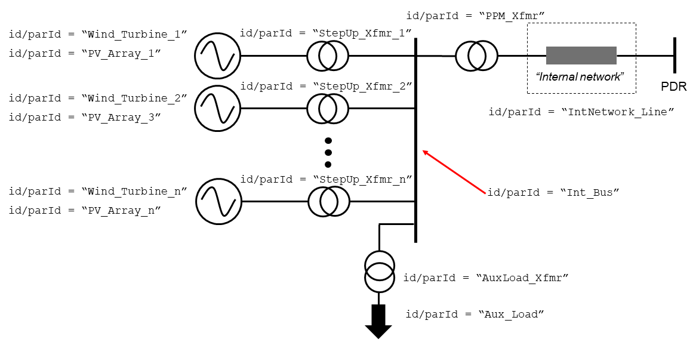

======
Inputs
======

Overview
--------

The inputs to DyCoV depend on the workflow you are running, but in all cases
the goal is the same: describe the producer's installation to the tool so it
can run the appropriate tests and compare the results against the applicable
criteria.

For **simulation-based workflows**, the core inputs are three files that
describe the Dynawo model on the producer's side — everything to the "left"
of the connection point (the PDR bus):

* **DYD** — defines the equipment and connectivity of the producer's network,
* **PAR** — contains the parameter values for each piece of equipment,
* **INI** — provides additional metadata that cannot be expressed in DYD/PAR
  files (nominal values, operating limits, topology, etc.).

It is also possible to skip the Dynawo model entirely and provide a set of
**producer curves** directly (see :ref:`Producer Curves <producerCurves>`
below). In this case DyCoV evaluates the PCS criteria on the provided curves
without running any simulation.

For **RMS Model Validation**, a set of **reference curves** is always required
in addition to the model or producer curves (see
:ref:`Reference Curves <referenceCurves>` below). These are the baseline
against which the model's response is compared.

See the ``examples/`` directory at the top level of the repository for
ready-to-run cases illustrating each input organization.

Producer Model
--------------

The *Producer Model* is built from three files: **DYD**, **PAR**, and **INI**.

The **DYD** file expresses the models and connectivity of the producer's
installation — everything to the left of the PDR bus. This bus should *not*
be defined in the producer's DYD, since it is already defined internally by
DyCoV to represent the grid connection point. The producer model should only
express the connections between the PDR bus and the production plant equipment.

The **PAR** file contains the parameter values for all equipment defined in
the DYD.

The **INI** file provides the additional information that DyCoV needs but
that cannot be derived from DYD/PAR files: nominal voltage, active and
reactive power limits, topology identifier, and so on.

For **Electric Performance Verification**, the three model files should all
live in the same directory, which is then passed to ``dycov performance``
via the ``-m`` option.

For **RMS Model Validation**, the directory must contain two subdirectories
named ``Zone1/`` and ``Zone3/``, each with its own set of three files.
Zone 1 should represent a single production unit (e.g. a single wind turbine),
while Zone 3 should represent the complete installation at the PDR, including
plant-level control. For the precise definition of these zones, refer to
PCS I16 in the RTE DTR.

.. note::
   The name *PDR* always refers to the real connection point of the complete
   installation to RTE's grid. The connection node of the Zone 1 unit model is
   an internal node of the aggregated plant model, named **InternalNode1** in
   DyCoV outputs (reports, figures, and curve signal names such as
   ``InternalNode1_BUS_Voltage``) — it corresponds to the node called *Node1*
   in the DTR. In the DYD/PAR files the connection bus keeps its internal id
   ``BusPDR`` for both zones, and reference-curve dictionaries for Zone 1
   accept both namings. The converter-output node of the Zone 1 unit model,
   between the unit and its transformer, is named **InternalNode2** (the node
   called *Node2* in the DTR); the injector-terminal signals
   (``*_GEN_IpInjTerminal``, ``*_GEN_IqInjTerminal``, ``*_GEN_UPuInjTerminal``)
   are measured there.

For information on the DYD and PAR file formats, refer to the
`Dynawo documentation <https://dynawo.github.io/>`_.

.. _gfm_producer_input:

GFM Producer Input (.ini file)
^^^^^^^^^^^^^^^^^^^^^^^^^^^^^^^

The ``dycov generateEnvelopes`` command takes a dedicated ``.ini`` file that
describes the Grid-Forming unit. It must contain a ``[DEFAULT]`` section for
nominal and operational parameters, and a ``[GFM Parameters]`` section for
the core GFM control constants.

A typical file looks like this:

.. code-block:: ini
   :caption: Example GFM Producer INI file

   [DEFAULT]
   # Nominal voltage at the PDR bus (in kV)
   # Allowed values: 400, 225, 150, 90, 63 (land) and 132, 66 (offshore)
   u_nom = 225
   # Active power limits (in MW)
   p_max_injection = 100.0
   p_min_injection = 0.0
   # Reactive power limits (in MVar)
   q_max = 50.0
   q_min = -50.0

   [GFM Parameters]
   # Damping constant
   D = 20.0
   # Inertia constant (in seconds)
   H = 3.5
   # Effective reactance from the inverter to the PDR (in pu)
   Xeff = 0.15
   # Nominal apparent power (in MVA)
   Snom = 110.0

For **Hybrid mode** (combining overdamped and underdamped envelopes), the
``[GFM Parameters]`` section should instead define separate damping and
inertia sets — ``Xeff`` is still required, and ``save_all_envelopes`` controls
whether the intermediate overdamped and underdamped traces are kept in the
CSV output alongside the merged envelope:

.. code-block:: ini

   [GFM Parameters]
   D_Overdamped = 25.0
   H_Overdamped = 4.0
   D_Underdamped = 10.0
   H_Underdamped = 2.5
   Xeff = 0.15
   Snom = 110.0
   save_all_envelopes = False

.. seealso::
   :ref:`GFM Envelope Generation <gfm_envelopes_cmd>` for a description of
   supported disturbance cases and output format.

Supported Dynamic Models
^^^^^^^^^^^^^^^^^^^^^^^^^

Dynawo supports a wide variety of equipment models, and parameter names vary
across models even when they refer to the same physical quantity. For example,
the voltage regulation setpoint of a generating unit is called
``voltageRegulator_UsRefPu`` for synchronous generators,
``WTG4B_wecc_repc_URefPu`` for WECC wind models, and ``WPP_xWPRefPu`` for
IEC models. DyCoV maintains an internal dictionary that maps all these
variant names to a common identifier (``VoltageSetpointPu`` in this example).

This translation is transparent to the user, but it means that **supporting a
new or updated Dynawo model requires updating this internal dictionary**. See
the Developer Manual for details.

Currently supported models:

* Bus:
    * InfiniteBus
        Bus whose voltage magnitude and angle remains constant throughout the simulation
    * InfiniteBusFromTable
        Infinite bus with UPu, UPhase and omegaRefPu given by tables as functions of time
    * Bus
        Default bus model (just an electric node)
* Synchronous generators:
    * GeneratorSynchronousFourWindingsGoverPropVRPropInt
        Machine with four windings, a proportional governor on mechanical power and a
        proportional integral excitation voltage regulator
    * GeneratorSynchronousFourWindingsProportionalRegulations
        Machine with four windings, a proportional governor on mechanical power and a
        proportional excitation voltage regulator
    * GeneratorSynchronousFourWindingsTGov1Sexs
        Machine with four windings and standard IEEE regulations - TGov1, SEXS
    * GeneratorSynchronousFourWindingsTGov1SexsPss2a
        Machine with four windings and standard IEEE regulations - TGov1, SEXS and PSS2A
    * GeneratorSynchronousFourWindingsVRKundur
        Machine with four windings, fixed mechanical power and a Kundur proportional voltage
        regulator with no power system stabilizer
    * GeneratorSynchronousFourWindingsVRKundurPssKundur
        Machine with four windings, fixed mechanical power and a Kundur proportional voltage
        regulator with a power system stabilizer
    * GeneratorSynchronousThreeWindingsGoverPropVRPropInt
        Machine with three windings, a proportional governor on mechanical power and a
        proportional integral excitation voltage regulator
    * GeneratorSynchronousThreeWindingsProportionalRegulations
        Machine with three windings, a proportional governor on mechanical power and a
        proportional excitation voltage regulator
    * GeneratorSynchronousThreeWindingsDTRI8
        Ad-hoc machine model for the I8 PCS
* WECC Wind models:
    * WTG4AWeccCurrentSource
        WECC Wind Turbine model with a simplified drive train model (dual-mass model) and with a
        current source as interface with the grid
    * WTG4BWeccCurrentSource
        WECC Wind Turbine model with a current source as interface with the grid
    * WT4AWeccCurrentSource
        WECC Wind Turbine model with a simplified drive train model (dual-mass model), without the
        plant controller and with a current source as interface with the grid
    * WT4BWeccCurrentSource
        WECC Wind Turbine model without the plant controller and with a current source as interface
        with the grid
* IEC Wind models:
    * IECWPP4ACurrentSource2015
        Wind Power Plant Type 4A model from IEC 61400-27-1:2015
    * IECWPP4BCurrentSource2015
        Wind Power Plant Type 4B model from IEC 61400-27-1:2015
    * IECWPP4ACurrentSource2020
        Wind Power Plant Type 4A model from IEC 61400-27-1:2020
    * IECWPP4BCurrentSource2020
        Wind Power Plant Type 4B model from IEC 61400-27-1:2020
    * IECWT4ACurrentSource2015
        Wind Turbine Type 4A model from IEC 61400-27-1:2015
    * IECWT4BCurrentSource2015
        Wind Turbine Type 4B model from IEC 61400-27-1:2015
    * IECWT4ACurrentSource2020
        Wind Turbine Type 4A model from IEC 61400-27-1:2020
    * IECWT4BCurrentSource2020
        Wind Turbine Type 4B model from IEC 61400-27-1:2020
* WECC Storage models:
    * BESSWeccCurrentSource
        WECC Storage model
    * BESSWeccCurrentSourceNoPlantControl
        WECC Storage model without the plant controller
* Lines:
    * Line
        AC power line - PI model
* Loads:
    * LoadAlphaBeta
        Load with voltage-dependent active and reactive power (alpha-beta model)
    * LoadPQ
        Load with constant reactive/active power
* Transformers:
    * TransformerFixedRatio
        Two winding transformer with a fixed ratio
    * TransformerRatioTapChanger
        Two winding transformer with a fixed phase and variable ratio

.. _referenceCurves:

Reference Curves
----------------

RMS Model Validation always requires reference curves — the baseline dynamic
behavior against which the model's response is evaluated. These are typically
obtained from field measurements or EMT simulations, though RMS curves from a
phasor simulation tool are also accepted.

The reference curves directory follows this structure:

    Reference curves structure

Each test case (Operating Condition) requires a curve file and an associated
DICT file. The example above shows a PCS with two Benchmarks: Benchmark1 has
two Operating Conditions and Benchmark2 has one.

Accepted curve file formats:

* **COMTRADE** — all versions up to C37.111-2013 are accepted, either as a
  single CFF file or as a DAT+CFG pair (both files must share the same name).
* **EUROSTAG** — only the EXP ASCII format is supported.
* **CSV** — the column separator must be ``";"``. A ``time`` column is
  required but does not need to be the first column.

Regardless of the format, **a companion DICT file is always mandatory**. It
must have the same filename as the curve file but with the ``.dict``
extension. This file provides two types of information that cannot be inferred
from the curve file itself:

* the mapping between curve columns and the signal names expected by DyCoV,
* simulation parameters used to obtain the curves (event timing, etc.).

The simulation parameters must be filled in. When a DICT file declares one of
them without a value, DyCoV stops before simulating and names the file and the
option: replacing the missing value with a default would validate the model
against an event placed at another instant of time.

The DICT file uses INI format, interpreted by Python's ``configparser``
module. The precise syntax is described in the
`Supported ini file structure <https://docs.python.org/3/library/configparser.html#supported-ini-file-structure>`_
documentation.

.. _producerCurves:

Producer Curves
---------------

Producer curves follow the same file format and DICT requirements as
:ref:`Reference Curves <referenceCurves>`. The key difference is their role:
producer curves represent the producer's response, not a reference baseline.

For **RMS Model Validation**, a single set of curve files is shared across
zones. The zone is identified through the PCS identifier in the filename
(``z1`` or ``z3``) and through a per-zone ``Producer.ini`` file. The
``ProducerCurves/`` directory is a self-contained entity, separate from the
Dynawo model examples:

.. code-block:: text

   ProducerCurves/
   └── PPM/
       ├── Producer/
       │   ├── CurvesFiles.ini
       │   ├── PCS_RTE-I16z1.<Benchmark>.<OC>.csv
       │   ├── PCS_RTE-I16z1.<Benchmark>.<OC>.dict
       │   ├── PCS_RTE-I16z3.<Benchmark>.<OC>.csv
       │   └── PCS_RTE-I16z3.<Benchmark>.<OC>.dict
       ├── Zone1/
       │   └── Producer.ini
       └── Zone3/
           └── Producer.ini

For **Electric Performance Verification**, there is no Zone 1 / Zone 3
distinction. A single ``Producer.ini`` covers the entire case:

.. code-block:: text

   ProducerCurves/
   └── PPM/
       ├── Producer/
       │   ├── CurvesFiles.ini
       │   ├── PCS_RTE-I*.csv
       │   └── PCS_RTE-I*.dict
       └── Producer.ini

.. _topologies:

Available Topologies
--------------------

DyCoV currently supports eight topologies to represent the producer model.
The topology is declared in the ``Producer.ini`` file and determines how
DyCoV connects the producer's equipment to the connection bus internally
(the PDR bus — or InternalNode1 for Zone 1 of the RMS model validation).

Every topology places a main transformer (``Main_Xfmr``) next to the PDR bus,
and the generating units hang from an internal bus (``Int_Bus``) behind it.
The group transformer of each unit is part of the unit's own dynamic model, so
it is not modelled as a separate block. When an internal network line is used
(the ``+i`` variants) it sits on the MV side of the main transformer, between it
and the internal bus, and the auxiliary load hangs from that same internal bus.
Only the main transformer regulates its ratio: the group and auxiliary load
transformers are fixed-ratio.

    S and S+i topologies

* S
    Single :abbr:`gen (generator)`/:abbr:`WT (Wind Turbine)`/:abbr:`PV (Photovoltaic Array)`
* S+i
    Single :abbr:`gen (generator)`/:abbr:`WT (Wind Turbine)`/:abbr:`PV (Photovoltaic Array)` + Internal Network Line

    S+Aux and S+Aux+i topologies

* S+Aux
    Single :abbr:`gen (generator)`/:abbr:`WT (Wind Turbine)`/:abbr:`PV (Photovoltaic Array)` + Auxiliary Load
* S+Aux+i
    Single :abbr:`gen (generator)`/:abbr:`WT (Wind Turbine)`/:abbr:`PV (Photovoltaic Array)` + Auxiliary Load + Internal Network Line

    M and M+i topologies

* M
    Multiple :abbr:`WT (Wind Turbine)`/:abbr:`PV (Photovoltaic Array)`
* M+i
    Multiple :abbr:`WT (Wind Turbine)`/:abbr:`PV (Photovoltaic Array)` + Internal Network Line

    M+Aux and M+Aux+i topologies

* M+Aux
    Multiple :abbr:`WT (Wind Turbine)`/:abbr:`PV (Photovoltaic Array)` + Auxiliary Load
* M+Aux+i
    Multiple :abbr:`WT (Wind Turbine)`/:abbr:`PV (Photovoltaic Array)` + Auxiliary Load + Internal Network Line

.. note::
   For Zone 1 :abbr:`WT (Wind Turbine)`/:abbr:`PV (Photovoltaic Array)` validation,
   only the S topology is allowed. Zone 1 stops at the internal node, so it has no
   main transformer; the unit is connected through its group transformer
   (``Group_Xfmr``), which is modelled explicitly only when the dynamic model
   declares ``ConverterLVControl = true``. Otherwise the converter already reaches
   the internal node through its own transformer and no external one is expected.

   .. figure:: figs_topologies/zone1.png
       :width: 500px

       S Topology

Generating input files
----------------------

If you have the RTE workbook describing the installation, ``dycov
excel2inputs`` writes every input file from it in one step:

.. code-block:: console

   dycov excel2inputs Producer.xlsx

The workbook is the single source of truth: the model comes from its
``Model Map`` sheet, the electrical values from the ``Zone1a`` and ``Zone3``
sheets, the control parameters from the block sheets that ``Général`` selects,
and the reference curves from the two ``Signaux`` sheets. The command writes
two trees next to the workbook — or under ``--output``, if you give one:

.. code-block:: text

   Dynawo/Zone1/Producer.{dyd,par,ini}
   Dynawo/Zone3/Producer.{dyd,par,ini}
   ReferenceCurves/Producer/CurvesFiles.ini + one .dict per test + the .csv files

which is exactly what ``dycov validate`` expects, as ``-m Dynawo`` and
``ReferenceCurves``.

If you do not need to keep those files, ``dycov validate`` takes the workbook
directly and does the conversion itself:

.. code-block:: console

   dycov validate --excel Producer.xlsx

The inputs are generated into a temporary directory that is removed when the
run ends — the only input you keep is the workbook, and the report names it
instead of the directory that no longer exists. The conversion is checked
before the validation starts: if the workbook leaves the curve metadata of a
test blank, the run stops there saying which tests are affected, rather than
failing later when DyCoV tries to read the reference curves.

The run reports what it could not complete rather than failing silently: the
blocks of ``Général`` whose parameter sheet contributed nothing, the ``.csv``
files named in the sheets that were not found in the results folder, and the
tests whose curve metadata is still blank. A row that is needed and is absent,
empty or not a number is refused naming the sheet, the row and what was found,
so an unfilled workbook says so instead of producing half a model.

Every sheet, row and header name the command looks for lives in a
configuration file, ``excel_names.ini``. A copy of it, fully commented out,
sits in your configuration directory (``~/.config/dycov`` on Linux,
``%LOCALAPPDATA%\dycov`` on Windows): uncomment a name there and the command
reads your spelling instead of the one shipped, with no need to wait for a new
release.
