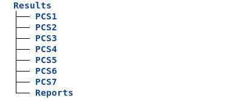
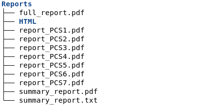
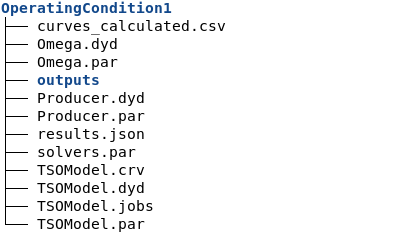

=======
Results
=======

After each run, DyCoV writes all its outputs to a ``Results/`` directory
created in the working directory. Everything is organized to make it easy to
find what you need: a quick summary at the top, detailed per-PCS reports, and
the raw data and simulation files for each individual test case.

Organization of the Results folder
------------------------------------

    Results structure

The top level contains two types of entries:

* ``Reports/`` — the PDF and HTML outputs, described in detail below.
* ``PCS_*/`` — one folder per PCS that was executed, each organized
  hierarchically by Benchmark and Operating Condition.

Reports
^^^^^^^

    Reports structure

The ``Reports/`` folder contains:

* ``summary_report.pdf`` — a concise summary of all PCS results: which tests
  passed, which failed, and the key compliance metrics.
* ``report_*.pdf`` — one detailed report per PCS, with full data tables,
  graphs, and compliance analysis for each Operating Condition.
* ``full_report.pdf`` — all the detailed reports concatenated into a single
  document, useful for submission or archiving.
* ``HTML/`` — one HTML file per test case, containing interactive versions of
  the same figures shown in the PDF reports. These are particularly useful for
  exploring the curves in detail, zooming in on specific time windows, or
  comparing simulated and reference responses side by side.

PCS Results
^^^^^^^^^^^

Each ``PCS_*/`` folder follows the same three-level hierarchy used throughout
the tool:

1. **PCS** — the top-level grouping, corresponding to one DTR fiche (e.g.
   PCS I16, PCS I6). Each PCS contains one or more Benchmarks.

2. **Benchmark** — a specific type of test event (e.g. a three-phase fault,
   a setpoint step). A benchmark becomes a concrete test once the Operating
   Conditions are specified.

3. **Operating Condition (OC)** — the full specification of a single test
   instance: initial operating point, event parameters, and grid parameters.

OC Results
~~~~~~~~~~

Each OC folder contains the data generated for that specific test:

    OC Results contents

* **CSV files** — the calculated curves and, when applicable, the reference
  curves, ready for post-processing or comparison in external tools.
* **Dynawo files** (``*.dyd``, ``*.par``, ``*.jobs``, ``*.crv``) — the
  complete model used for the simulation, including both the TSO's grid-side
  model and the producer's model. These files are useful for debugging or for
  re-running a specific test in Dynawo directly.
* **``results.json``** — the computed compliance metrics and intermediate
  values in a structured format, useful for programmatic post-processing.
* **``outputs/``** — Dynawo's raw simulation outputs. See the
  `Dynawo documentation <https://dynawo.github.io/>`_ for details on the
  content of this folder.

GFM Envelope Generation Results
---------------------------------

GFM analysis produces a different set of outputs, since no simulation is
involved. Results are written directly under ``Results/PCS_RTE-IGFMx/``,
organized by disturbance scenario and operating condition:

.. code-block:: text

   Results/
   └── PCS_RTE-IGFMx/
       └── S_<Scenario>/
           └── OC<k>/
               ├── *.csv      (envelope time series)
               ├── *.png      (static figure)
               ├── *.html     (interactive figure)
               └── *_ini_dump.txt  (Hybrid mode only)

* **CSV files** — the numerical time series of the upper and lower admissible
  envelopes. When ``save_all_envelopes = true``, the file also includes the
  individual overdamped and underdamped traces.
* **PNG figures** — static visualizations of the envelopes alongside the PCC
  signal.
* **HTML files** — interactive versions of the same figures.
* **INI dump** (Hybrid mode only) — the exact set of input parameters used for
  the calculation, including internally derived values. Intended for full
  traceability.

PDF Report structure
---------------------

All PDF reports (for RMS validation and Electric Performance) follow the same
internal structure:

1. **Model** — describes the test setup: the network configuration, operational
   points, and circuit schematics relevant to the test being reported.

2. **Initialization** — documents the initial conditions used for the
   simulation: voltage levels, power settings, and equipment parameters. This
   section helps verify that the simulation started from the correct state.

3. **Simulation** — presents the dynamic evolution of the system during the
   test. Key electrical quantities (voltage, active power, reactive power,
   current) are shown as time-series graphs, and the timeline of events is
   annotated on the figures.

4. **Results** — compares the simulated response against the reference curves
   (for RMS validation) or against the PCS compliance thresholds (for
   performance tests). Graphs show deviations clearly, and the key performance
   indicators are tabulated:

   * Maximum Error (MXE)
   * Mean Error (ME)
   * Mean Absolute Error (MAE)
   * Rise time, reaction time, settling time, overshoot

5. **Compliance** — the bottom line: for each criterion defined in the
   applicable PCS, a pass/fail check is shown against the predefined threshold.
   This is the section to read first if you just want to know whether the
   installation meets the requirements.