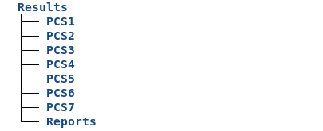
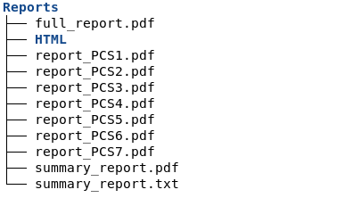
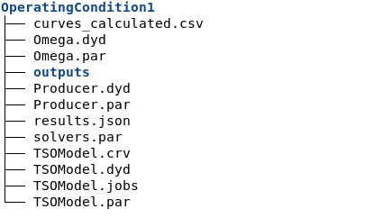

=======
Results
=======

After each run, DyCoV writes all its outputs to a ``Results/`` directory
created next to the input: inside the directory that contains the producer
model, the producer curves, or the GFM input file, depending on the command.
Use ``-o`` to choose a different location. Everything is organized to make it
easy to find what you need: a quick summary at the top, detailed per-PCS
reports, and the raw data and simulation files for each individual test case.

Organization of the Results folder
------------------------------------

    Results structure

The top level contains two types of entries:

* ``Reports/`` — the PDF and HTML outputs, described in detail below.
* ``PCS_*/`` — one folder per PCS that was executed, each organized
  hierarchically by Benchmark and Operating Condition.

Reports
^^^^^^^

    Reports structure

The ``Reports/`` folder contains:

* ``report.pdf`` — the full compliance report: a summary section with the
  overall result of every executed test, followed by one detailed chapter per
  PCS with data tables, graphs, and the compliance analysis of each Operating
  Condition.
* ``HTML/`` — one HTML file per test case, containing interactive versions of
  the same figures shown in the PDF report. These are particularly useful for
  exploring the curves in detail, zooming in on specific time windows, or
  comparing simulated and reference responses side by side.

PCS Results
^^^^^^^^^^^

Each ``PCS_*/`` folder follows the same three-level hierarchy used throughout
the tool:

1. **PCS** — the top-level grouping, corresponding to one DTR fiche (e.g.
   PCS I16, PCS I6). Each PCS contains one or more Benchmarks.

2. **Benchmark** — a specific type of test event (e.g. a three-phase fault,
   a setpoint step). A benchmark becomes a concrete test once the Operating
   Conditions are specified.

3. **Operating Condition (OC)** — the full specification of a single test
   instance: initial operating point, event parameters, and grid parameters.

OC Results
~~~~~~~~~~

Each OC folder contains the data generated for that specific test:

    OC Results contents

* **CSV files** — the calculated curves and, when applicable, the reference
  curves, ready for post-processing or comparison in external tools. In
  Zone 1, the connection-bus columns are saved under the
  ``InternalNode1_BUS_*`` naming — *PDR* is reserved for the real connection
  point.
* **Dynawo files** (``*.dyd``, ``*.par``, ``*.jobs``, ``*.crv``) — the
  complete model used for the simulation, including both the TSO's grid-side
  model and the producer's model. These files are useful for debugging or for
  re-running a specific test in Dynawo directly.
* **results.json** — the computed compliance metrics and intermediate
  values in a structured format, useful for programmatic post-processing.
* **outputs/** — Dynawo's raw simulation outputs. See the
  `Dynawo documentation <https://dynawo.github.io/>`_ for details on the
  content of this folder.

GFM Envelope Generation Results
---------------------------------

GFM analysis produces a different set of outputs, since no simulation is
involved. Results are written directly under ``Results/PCS_RTE-IGFMx/``,
organized by disturbance scenario and operating condition:

.. code-block:: text

   Results/
   └── PCS_RTE-IGFMx/
       └── S_<Scenario>/
           └── OC<k>/
               ├── *.csv      (envelope time series)
               ├── *.png      (static figure)
               ├── *.html     (interactive figure)
               └── *_ini_dump.txt  (Hybrid mode only)

* **CSV files** — the numerical time series of the upper and lower admissible
  envelopes. When ``save_all_envelopes = true``, the file also includes the
  individual overdamped and underdamped traces.
* **PNG figures** — static visualizations of the envelopes alongside the PCC
  signal.
* **HTML files** — interactive versions of the same figures.
* **INI dump** (Hybrid mode only) — the exact set of input parameters used for
  the calculation, including internally derived values. Intended for full
  traceability.

Report interpretation
---------------------

DyCoV also generates detailed PDF reports describing the behavior
of the installation and the outcome of each test.

These reports follow a standardized structure shared across all workflows.

For a detailed description of report organization and interpretation,
including PCS structure, plots, KPIs and compliance checks, see:

:ref:`Understanding reports <understanding-reports>`