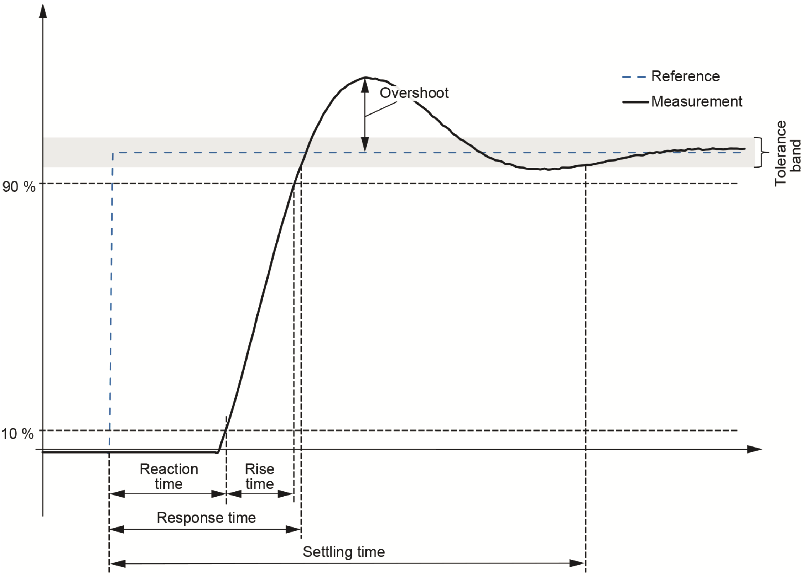

================
Validation Tests
================

DyCoV implements two distinct types of validation, addressing different
regulatory requirements:

(a) **RMS model validation** — verifies that a dynamic model of the producer's
    installation matches a reference behavior within the tolerances defined by
    RTE (PCS I16).

(b) **Electrical performance verification** — verifies that the installation
    meets the dynamic performance requirements of RTE's grid code, as specified
    in the applicable DTR PCSs.

In both types, the tool runs a series of independent tests organized according
to the DTR's PCS structure. The following tests are currently implemented:

* **RMS model validation (Power Parks)**: PCS I16, structured into:

  - *Zone 1* (unit-level): Fault Ride-Through, Step Response to Control
    Setpoints, Ramp Response to Grid Frequency, and Step Response to Grid
    Voltage.

  - *Zone 3* (plant-level): Stability of Controls (like I2), Fault
    Ride-Through (like I5), V-sag Ride-Through (like I6), V-surge Ride-Through
    (like I7), and Islanding (like I10).

* **Electrical performance (Power Park Modules)**: PCSs I2, I5, I6, I7, and I10.

* **Electrical performance (Battery Energy Storage Systems)**: PCSs I2, I5, I6,
  I7, and I10.

* **Electrical performance (Synchronous Machines)**: PCSs I2, I3, I4, I6, I7,
  I8, and I10.

The performance tests for PPM, BESS, and SM share the same launcher
(``dycov performance``). A single PDF report is generated covering all the
PCSs that were run.

For details on how the results of these tests are reported and interpreted,
see:

:ref:`Understanding reports <understanding-reports>`

Conceptual structuring of the tests
-------------------------------------

.. note::
Please do not skip this section: understanding these concepts will help
you learn the tool and navigate the results much faster!

All tests share the same conceptual split between the producer's model and the
grid-side model:

* **Producer's model** — the DYD+PAR Dynawo files describing the portion of
  the system electrically located on the producer side of the PDR bus.
  These files are provided by the producer and remain the same across all tests.

* **TSO's model** — the grid-side model, everything electrically located on
  the grid side of the PDR. These files are internal to the tool and change
  from test to test as defined by each PCS in the DTR. Different tests define
  different *benchmarks*: some specify three or four transmission lines,
  while others use a single-line configuration.

In addition to benchmark variations, tests are also run at different
*operating conditions*, which define how each simulation is configured.

This gives rise to the following conceptual hierarchy:

.. code-block::

launcher
├── <PCS a>
│   ├── <Benchmark j>
│   │   └── <Operating Condition x>
│   │       └── <Operating Point>
│   └── <Benchmark k>
│       ├── <Operating Condition y>
│       │   └── <Operating Point>
│       └── <Operating Condition z>
│           └── <Operating Point>
├── <PCS b>
│   └── ...
└── <PCS c>
└── ...

That is, the launcher runs one or more DTR PCSs (the user may configure which
ones to run or skip). Each PCS runs the tests defined in the DTR. Each test
may consist of one or more benchmark configurations, and for each benchmark
the DTR defines one or more operating conditions, potentially evaluated under
different operating points.

This hierarchy is fundamental to understanding how DyCoV organizes executions
and aggregates results in the final reports.

Operating Conditions (OC)
^^^^^^^^^^^^^^^^^^^^^^^^^

An **Operating Condition (OC)** is the main hierarchical container used to
define a complete simulation scenario. It groups all the parameters required
to execute a test consistently. An Operating Condition includes:

* **Initial operating point**, typically defined by:
  :math:`V`, :math:`P`, and :math:`Q` at the PDR.
* **Event characteristics**, including:
  type of event (e.g. fault, step change),
  timing, duration, and magnitude.
* **Grid-side parameters**, such as:
  Short-Circuit Ratio (SCR), equivalent impedance, or other
  TSO-defined parameters.

Each PCS includes a predefined set of Operating Conditions derived from the
DTR. On the user side, these conditions can be:

* **Overridden**, by modifying specific parameters of an existing OC.
* **Extended**, by defining a new OC derived from an existing one.

Operating Points
^^^^^^^^^^^^^^^^

An **Operating Point** corresponds to the subset of parameters within an
Operating Condition that defines the **initial steady-state of the system**,
typically:

* Voltage :math:`V`
* Active power :math:`P`
* Reactive power :math:`Q`

In practice, Operating Points represent variations of the same simulation
scenario with different initial conditions. Typical examples include:

* :math:`Q = 0` vs. :math:`Q = Q_{max}`
* Different reactance values (e.g. :math:`X_a` vs. :math:`X_b`)
* Different loading levels (e.g. partial vs. full :math:`P_{max}`)

An Operating Condition may therefore include **multiple Operating Points**.

PCS and Benchmark definitions
^^^^^^^^^^^^^^^^^^^^^^^^^^^^^

For completeness, the following definitions apply:

* **PCS**  
  A PCS is the set of tests and compliance criteria required to validate either:

  * the producer’s model (**RMS model validation**), or
  * the installation’s electrical dynamic performance (**Electrical performance verification**).

* **Benchmark**  
  A Benchmark defines a specific **TSO-side network configuration**, together
  with the associated event to be simulated (e.g. fault, voltage step). It
  represents the invariant description of the grid model used during the test.

Within this framework:

* A **PCS** contains one or more **Benchmarks**
* Each **Benchmark** is evaluated under one or more **Operating Conditions**
* Each **Operating Condition** may include one or more **Operating Points**

Definition summary
^^^^^^^^^^^^^^^^^^

* **Benchmark** → defines the *grid setup and event*
* **Operating Condition** → defines the *complete simulation scenario*
* **Operating Point** → defines the *initial state of the scenario*

RMS model validation (Power Park Modules)
------------------------------------------

RMS model validation checks that the dynamic response of a PPM model matches
a set of reference curves within the tolerances defined in PCS I16. It always
runs two independent perimeters: Zone 1 (unit-level) and Zone 3 (plant-level).

In Zone 1 the unit under test connects at an internal node of the aggregated
plant model, named **InternalNode1** in DyCoV outputs (the node called *Node1*
in the DTR). The name *PDR* is reserved for the real connection point of the
complete installation to RTE's grid, which is the point used in Zone 3.

Reference curves are always required. The producer response can come from
Dynawo simulations or from producer-provided curves.

PCS I16
^^^^^^^

The test cases are grouped into two PCS corresponding to the two validation
zones. The simulated events cover reference tracking and disturbance rejection,
including three-phase faults. For Zone 3, two extreme values of the grid
connection impedance :math:`X_{sc}` are often considered — :math:`X^{min}_{sc}`
and :math:`X^{max}_{sc}` — representing the minimal and maximal Short-Circuit
Level at the connection point.

Each row in the table below corresponds to a single Operating Condition (OC),
defined by an operating point (OP), event parameters, and grid parameters.

.. list-table:: Predefined benchmarks for Zone 1 (unit-level).
    :header-rows: 2

    * - Benchmark
      - Operating Conditions
      -
      -
    * -
      - OP
      - event params.
      - grid params.
    * - 3-ph fault
      - :math:`U_n,\ P_{max},\ Q=0`
      - :math:`T_{clear}=150ms`
      - SCR=3
    * -
      - :math:`U_n,\ P_{max},\ Q=0`
      - :math:`T_{clear}=150ms`
      - SCR=10
    * -
      - :math:`U_n,\ P_{max},\ Q_{min}`
      - :math:`T_{clear}=150ms`
      - SCR=3
    * -
      - :math:`U_n,\ P_{max},\ Q=0`
      - :math:`\text{Hi-Z }(V_r=0.5U_n),\ T_{clear}=800ms`
      - SCR=3
    * -
      - :math:`U_n,\ P_{max},\ Q=0`
      - :math:`\text{Hi-Z }(V_r=0.7U_n),\ T_{clear}=500ms`
      - SCR=3
    * -
      - :math:`U_n,\ P_{max},\ Q=0`
      - :math:`T_{clear}=\infty`
      - SCR=10
    * -
      - :math:`U_n,\ P_{max},\ Q=0`
      - :math:`\text{Hi-Z }(V_r=0.5U_n),\ T_{clear}=\infty`
      - SCR=10
    * - setpoint step
      - :math:`U_n,\ P_{max},\ Q=0`
      - :math:`{\Delta}V^{sp}=+5\%U_n`
      - SCR=3
    * -
      - :math:`U_n,\ P_{max},\ Q_{min}`
      - :math:`{\Delta}P^{sp}=-5\%P_{max}`
      - SCR=3
    * -
      - :math:`U_n,\ P_{max},\ Q=0`
      - :math:`{\Delta}Q^{sp}=-5\%Q_{max}`
      - SCR=3
    * - grid :math:`{\omega}` ramp
      - :math:`U_n,\ P_{max},\ Q=0`
      - :math:`{\Delta}{\omega}=+0.5Hz\ in\ 250ms`
      - SCR=3
    * - grid V step
      - :math:`0.95U_n,\ 0.5P_{max},\ Q_{min}`
      - :math:`{\Delta}V=+10\%U_n`
      - SCR=10
    * -
      - :math:`1.05U_n,\ 0.5P_{max},\ Q_{max}`
      - :math:`{\Delta}V=-10\%U_n`
      - SCR=10

.. list-table:: Predefined benchmarks for Zone 3 (plant-level).
    :header-rows: 2

    * - Benchmark
      - Operating Conditions
      -
      -
    * -
      - OP
      - event params.
      - grid params.
    * - U-setpoint step
      - :math:`U_n,\ P_{max},\ Q=0`
      - :math:`+2\%\ U_n`
      - :math:`X_{min}`
    * -
      - :math:`U_n,\ P_{max},\ Q=0`
      - :math:`+2\%\ U_n`
      - :math:`X_{max}`
    * - P-setpoint step
      - :math:`U_n,\ P_{max},\ Q=0`
      - :math:`-40\%\ P_{max}`
      - :math:`X_{max}`
    * -
      - :math:`U_n,\ 0.6P_{max},\ Q=0`
      - :math:`+40\%\ P_{max}`
      - :math:`X_{max}`
    * - Q-setpoint step
      - :math:`U_n,\ P_{max},\ Q=0`
      - :math:`+10\%\ P_{max}`
      - :math:`X_{max}`
    * -
      - :math:`U_n,\ P_{max},\ Q=0`
      - :math:`-20\%\ P_{max}`
      - :math:`X_{max}`
    * - 3-ph fault
      - :math:`U_n,\ P_{max},\ Q=0`
      - :math:`T_{clear}=85\ or\ 150ms`
      - :math:`X_{max}`
    * - V-dip
      - :math:`U_n,\ P_{max},\ Q=0`
      - specified V profile
      - :math:`X_{min}`
    * - V-swell
      - :math:`U_n,\ P_{max},\ Q_{max}`
      - specified V profile
      - :math:`X_{min}`
    * -
      - :math:`U_n,\ P_{max},\ Q_{min}`
      - specified V profile
      - :math:`X_{min}`
    * - islanding
      - :math:`U_n,\ 0.8P_{max},\ Q=0`
      - :math:`{\Delta}\ PQ = [+0.1,\ +0.04]P_{max}`
      - ---

.. image:: figs_pcs/circuit_z1.*
   :width: 70%
   :alt: network setup for PCS I16 Zone 1
   :align: center

Electrical performance verification  (Power Park Modules)
---------------------------------------------------------

Electrical performance verification for PPMs checks compliance with the dynamic
performance requirements of the applicable DTR PCSs. No reference curves are
required — the tool evaluates the producer response directly against the PCS
criteria.

The producer response can come from Dynawo simulations or from
producer-provided curves.

PCS I2
^^^^^^^

.. note::
   The DTR specifies that this PCS applies to PPM classes: B, C, D, and Offshore.

Checks for compliant behavior of the generator under a step change in the
setpoint of the voltage control.

.. image:: figs_pcs/circuit_I2PPM.*
   :width: 70%
   :alt: network setup for PCS I2 (PPMs)
   :align: center

.. note::
   This test does not yet implement the calculations of *control stability
   margins*. These will be included once Dynawo incorporates the necessary
   algorithms.

PCS I5
^^^^^^^

.. note::
   The DTR specifies that this PCS applies to PPM classes: B, C, D, and Offshore.

Checks for compliant behavior under a symmetric three-phase fault at one of
the four transmission lines (at 1% distance from the PDR). The PPM should
remain connected and supply the required reactive injection.

.. image:: figs_pcs/circuit_I5PPM.*
   :width: 70%
   :alt: network setup for PCS I5 (PPMs)
   :align: center

PCS I6
^^^^^^^

.. note::
   The DTR specifies that this PCS applies to PPM classes: B, C, D, and Offshore.

Checks for compliant behavior under a severe voltage drop at the PDR bus
(simulating the effect of a fault).

.. image:: figs_pcs/circuit_I6PPM.*
   :width: 70%
   :alt: network setup for PCS I6 (PPMs)
   :align: center

PCS I7
^^^^^^^

.. note::
   The DTR specifies that this PCS applies to PPM classes: B, C, D, and Offshore.

Checks for compliant behavior under a severe overvoltage at the PDR bus
(simulating the effect of a fault being cleared in the network).

.. image:: figs_pcs/circuit_I7PPM.*
   :width: 70%
   :alt: network setup for PCS I7 (PPMs)
   :align: center

PCS I10
^^^^^^^^

.. note::
   The DTR specifies that this PCS applies to PPM classes: B, C, D, and Offshore.

Checks for compliant behavior under an islanding event, where the PPM is left
as the only generating system sustaining the frequency of its subnetwork. Since
the DTR assumes the PPM technology is grid-following, a fictitious synchronous
condenser unit provides inertia and frequency reference for the island.

.. image:: figs_pcs/circuit_I10PPM.*
   :width: 70%
   :alt: network setup for PCS I10 (PPMs)
   :align: center

Electrical performance verification  (Synchronous Machines)
-----------------------------------------------------------

Electrical performance verification for synchronous machines follows the same
structure as for PPMs. The producer response can come from Dynawo simulations
or from producer-provided curves.

PCS I2
^^^^^^^

Checks for compliant behavior under a step change in the setpoint of the
generator's voltage control.

.. image:: figs_pcs/circuit_I2SM.*
   :width: 70%
   :alt: network setup for PCS I2 (SMs)
   :align: center

.. note::
   This test does not yet implement the calculations of *control stability
   margins*. These will be included once Dynawo incorporates the necessary
   algorithms.

PCS I3
^^^^^^^

.. note::
   The DTR specifies that this PCS applies only to generator classes: B, C, D.

Checks for compliant behavior under a sudden change in the admittance of the
network connection — specifically, the loss of one of three transmission lines
(a 33% loss in branch admittance).

.. image:: figs_pcs/circuit_I3SM.*
   :width: 70%
   :alt: network setup for PCS I3 (SMs)
   :align: center

PCS I4
^^^^^^^

.. note::
   The DTR specifies that this PCS applies to generator classes: B, C, D.

Checks for compliant behavior under a symmetric three-phase fault at one of
the four transmission lines (at 1% distance from the PDR).

.. image:: figs_pcs/circuit_I4SM.*
   :width: 70%
   :alt: network setup for PCS I4 (SMs)
   :align: center

PCS I6
^^^^^^^

.. note::
   The DTR specifies that this PCS applies to generator classes: B, C, D.

Checks for compliant behavior under a severe voltage drop at the PDR bus.

.. image:: figs_pcs/circuit_I6SM.*
   :width: 70%
   :alt: network setup for PCS I6 (SMs)
   :align: center

PCS I7
^^^^^^^

.. note::
   The DTR specifies that this PCS applies to generator classes: B, C, D.

Checks for compliant behavior under a severe overvoltage at the PDR bus.

.. image:: figs_pcs/circuit_I7SM.*
   :width: 70%
   :alt: network setup for PCS I7 (SMs)
   :align: center

PCS I8
^^^^^^^

.. note::
   The DTR specifies that this PCS applies to generator classes: B, C, D.

Checks for compliant behavior under a severe loss of load in the bulk
transmission network (7 GW out of 307 GW). The network side is modeled by a
large generator (340 GVA) and two large loads (300 and 7 GW).

.. image:: figs_pcs/circuit_I8SM.*
   :width: 70%
   :alt: network setup for PCS I8 (SMs)
   :align: center

PCS I10
^^^^^^^^

.. note::
   The DTR specifies that this PCS applies to generator classes: B, C, D.

Checks for compliant behavior under an islanding event where the generator is
left as the only synchronous machine sustaining the frequency of its
subnetwork. The generator should maintain stability until the restoration
process re-synchronizes the subnetwork with the bulk transmission network.

.. image:: figs_pcs/circuit_I10SM.*
   :width: 70%
   :alt: network setup for PCS I10 (SMs)
   :align: center

Step-response Characteristics
-------------------------------

Several compliance criteria are based on reaction time, rise time, settling
time, and overshoot. For RMS model validation tests, these definitions follow
exactly the IEC standard. For Electrical performance verification, the rise time is
defined as equivalent to the IEC reaction + rise time combined.

The figure below, taken from IEC 61400-21-1 (Section 3, Terms and definitions),
illustrates these step-response characteristics:

