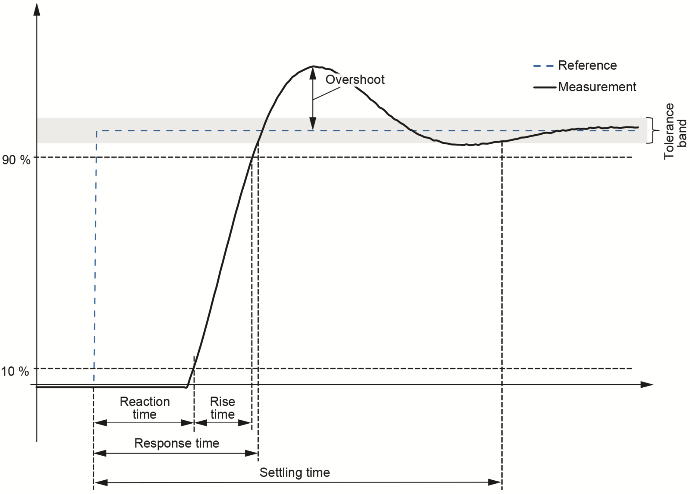

================
Validation Tests
================

The Dynamic Grid Compliance Verification tool can actually perform two very different types
of validation tests:

(a) Validation of *RMS model adequacy*, recently included in RTE's DTR as
    another requirement for producers (PCS I16).

(b) Validation of *electric performance requirements* of RTE's grid code, as
    specified in the DTR PCSs.

In both types of usage, the tool is structured as a series of independent tests.
These tests correspond to the *PCSs I** in RTE's DTR document.

To be more specific, the tool implements the following three types of tests :

  * **RMS Model Validation tests (Power Parks)**: PCS I16, structured into:
    
    - *Zone 1* (WT-level): Fault Ride-Through, Step Response to Control
      Setpoints, Ramp Response to Grid Frequency, and Step Response to Grid
      Voltage.
      
    - *Zone 3* (plant-level): Stability of Controls (like I2), Fault
      Ride-Through (like I5), V-sag Ride-Through (like I6), V-surge Ride-Through
      (like I7), and Islanding (like I10).

  * **Electric Performance tests (Synchronous Machines)**: PCSs I2 (except
    stability margin calculations), I3, I4, I6, I7, I8, and I10.

  * **Electric Performance tests (Power Parks)**: PCSs I2, I5, I6, I7, and I10.

The last two types of tests (performance tests) have the same launcher.

When the user will run the tool a single PDF report will generated including all
the PCS that have been run.

      

Conceptual structuring of the tests
-----------------------------------

.. note::   
   Please do not skip this section: understanding these concepts will help
   you to learn the tool and navigate the results much faster!

Common to all these tests is the conceptual split between the
producer's model and the grid-side model:

* **Producer's model:** the DYD+PAR Dynawo files that describe the producer's
  plant, that is, everything "to the left" of the connection point (the
  PDR). These two files are provided by the producer and they remain always the
  same for all types of tests.
  
* **TSO's model:** this is the grid-side model, that is, everything "to the
  right" of the PDR. These DYD+PAR files are internal to the application, and
  they change from test to test as defined by each specific PCS in the
  DTR. Different tests define different *"benchmarks"*: for instance, some
  tests specify three or for connecting lines, while others specify just one.

In addition to the variations due to these different benchmarks, one also
has variations in the specified *operating points* for the test. For instance,
operating at :math:`Q_\text{PDR} = 0` vs. :math:`Q_\text{PDR} = Q_\text{max}`.

Therefore, the tests are organized along this conceptual hierarchy:

.. code-block::

   launcher
   ├── <PCS a>
   │   ├── <Benchmarks j>
   │   │   └── <OperatingPoint x>
   │   ├── <Benchmarks k>
   │   │   ├── <OperatingPoint y>   
   │   │   └── <OperatingPoint z>
   ├── <PCS b>
   │   ├── <Benchmarks l>
   │   │   └── <OperatingPoint r>
   │   ├── <Benchmarks m>
   │   │   └── <OperatingPoint s>
   └── <PCS c>
       ├──  <Benchmarks n>
       │   └── <OperatingPoint t>
       └── ... etc.

That is, the launcher will run one or more DTR *PCSs* (the user may configure
to run all or skip some). Each PCS will run the tests specified in the
DTR. Each one of these tests may consist of one or more benchmark
configurations: the performance-related PCSs have only one benchmark, but
the RMS model validation PCS contains several topologies (because it consists
of several tests analogous to the electric performance PCSs). And finally, for
each benchmark the DTR may request to run tests at several operating points.

.. caution::
   Do not confuse these *benchmarks* with the allowed topologies on the
   producer's side, which are mentioned in the Inputs section (see
   :ref:`available topologies <topologies>`). Here, these topologies refer to
   the various network setups on RTE's side, and they are all internal to the
   tool. The user should supply only *one* producer model (or two in the case of
   Zone 1 / Zone 3 tests), and said model must be structured according to one of
   the allowed topologies (due to the way in which the tool calculates the
   initialization of the dynamic model).

   

RMS Model Validation tests (Power Park Modules)
-----------------------------------------------

Usually, the inputs are simply three files: the **DYD** and **PAR** files
corresponding to the Dynawo model on the producer's side (i.e., everything
"left" of the connection point, the PDR bus), and an **INI** file containing the
certain parameters and metadata that cannot be provided in the DYD/PAR
files. See the available examples in the `examples` directory, at the top level
of the git repository.

Additionally, in the case of *RMS Model Validation*, the user must also provide the
**reference curves** for each test, against which the simulated curves will be
compared. They should be provided as a CSV file and a DICT file that describes
the format.

The user has also the option of providing test curves to be used *instead of*
Dynawo simulations.

PCS I16
^^^^^^^^

The model validation test cases are currently grouped in two PCS, which respectively apply to
the two PPM zones: Zone 1, the individual generating unit; and Zone 3, the whole plant. The
simulated events encompass reference tracking and disturbance rejection, which include three-phase
faults. Tables 1 and 2 show all these tests and how they are structured following the
Benchmark/OC concepts. For Zone 3, two extreme values of the the grid connection impedance
:math:`X_{sc}` are often considered, :math:`X^{min}_{sc}` and :math:`X^{max}_{sc}`, representing
the minimal and maximal Short–Circuit Level (SCL) at the connection point. This test case selection
is the result of a harmonisation of the French TSO validation requirements between RMS and EMT
models, such that simulation results obtained for validating a given EMT model can directly be used
as reference signals for RMS model validation.

.. list-table:: Predefined benchmarks for Zone-1 (i.e. turbine-level).
    :header-rows: 2

    * - Benchmark
      - Operating Conditions
      -
      -
    * -
      - OP
      - event params.
      - grid params.
    * - 3-ph fault
      - :math:`U_n,\ P_{max},\ Q=0`
      - :math:`T_{clear}=150ms`
      - SCR=3
    * -
      - :math:`U_n,\ P_{max},\ Q=0`
      - :math:`T_{clear}=150ms`
      - SCR=10
    * -
      - :math:`U_n,\ P_{max},\ Q_{min}`
      - :math:`T_{clear}=150ms`
      - SCR=3
    * -
      - :math:`U_n,\ P_{max},\ Q=0`
      - :math:`\text{Hi-Z }(V_r=0.5U_n),\ T_{clear}=800ms`
      - SCR=3
    * -
      - :math:`U_n,\ P_{max},\ Q=0`
      - :math:`\text{Hi-Z }(V_r=0.7U_n),\ T_{clear}=500ms`
      - SCR=3
    * -
      - :math:`U_n,\ P_{max},\ Q=0`
      - :math:`T_{clear}=\infty`
      - SCR=10
    * -
      - :math:`U_n,\ P_{max},\ Q=0`
      - :math:`\text{Hi-Z }(V_r=0.5U_n),\ T_{clear}=\infty`
      - SCR=10
    * - setpoint step
      - :math:`U_n,\ P_{max},\ Q=0`
      - :math:`{\Delta}V^{sp}=+5\%U_n`
      - SCR=3
    * -
      - :math:`U_n,\ P_{max},\ Q_{min}`
      - :math:`{\Delta}P^{sp}=-5\%P_{max}`
      - SCR=3
    * -
      - :math:`U_n,\ P_{max},\ Q=0`
      - :math:`{\Delta}Q^{sp}=-5\%Q_{max}`
      - SCR=3
    * - grid :math:`{\omega}` ramp
      - :math:`U_n,\ P_{max},\ Q=0`
      - :math:`{\Delta}{\omega}=+0.5Hz\ in\ 250ms`
      - SCR=3
    * - grid V step
      - :math:`0.95U_n,\ 0.5P_{max},\ Q_{min}`
      - :math:`{\Delta}V=+10\%U_n`
      - SCR=10
    * -
      - :math:`1.05U_n,\ 0.5P_{max},\ Q_{max}`
      - :math:`{\Delta}V=-10\%U_n`
      - SCR=10

.. list-table:: Predefined benchmarks for Zone-3 (i.e. plant-level).
    :header-rows: 2

    * - Benchmark
      - Operating Conditions
      -
      -
    * -
      - OP
      - event params.
      - grid params.
    * - U-setpoint step 	
      - :math:`U_n,\ P_{max},\ Q=0`
      - :math:`+2\%\ U_n`
      - :math:`X_{min}`
    * - 	
      - :math:`U_n,\ P_{max},\ Q=0`
      - :math:`+2\%\ U_n`
      - :math:`X_{max}`
    * - P-setpoint step
      - :math:`U_n,\ P_{max},\ Q=0`
      - :math:`-40\%\ P_{max}`
      - :math:`X_{max}`
    * - 	
      - :math:`U_n,\ 0.6P_{max},\ Q=0`
      - :math:`+40\%\ P_{max}`
      - :math:`X_{max}`
    * - Q-setpoint step
      - :math:`U_n,\ P_{max},\ Q=0`
      - :math:`+10\%\ P_{max}`
      - :math:`X_{max}`
    * - 
      - :math:`U_n,\ P_{max},\ Q=0`
      - :math:`-20\%\ P_{max}`
      - :math:`X_{max}`
    * - 3-ph fault
      - :math:`U_n,\ P_{max},\ Q=0`
      - :math:`T_{clear}=85\ or\ 150ms`
      - :math:`X_{max}`
    * - V-dip
      - :math:`U_n,\ P_{max},\ Q=0`
      - specified V profile
      - :math:`X_{min}`
    * - V-swell
      - :math:`U_n,\ P_{max},\ Q_{max}`
      - specified V profile
      - :math:`X_{min}`
    * - 
      - :math:`U_n,\ P_{max},\ Q_{min}`
      - specified V profile
      - :math:`X_{min}`
    * - islanding
      - :math:`U_n,\ 0.8P_{max},\ Q=0`
      - :math:`{\Delta}\ PQ = [+0.1,\ +0.04]P_{max}`
      - --- 

.. image:: figs_pcs/circuit_z1.*
   :width: 70%
   :alt: network setup for PCS I16 Zone 1
   :align: center

Electric Performance tests (Power Park Modules)
-----------------------------------------------

Usually, the inputs are simply three files: the **DYD** and **PAR** files
corresponding to the Dynawo model on the producer's side (i.e., everything
"left" of the connection point, the PDR bus), and an **INI** file containing the
certain parameters and metadata that cannot be provided in the DYD/PAR
files. See the available examples in the `examples` directory, at the top level
of the git repository.

In the case of *Electric Performance* testing, the user has also the option of
providing test curves, either to be used *instead of* Dynawo simulations, or to
be used along Dynawo simulations (just for plotting both and comparing them).

PCS I2
^^^^^^^^
.. note::   
   The DTR specifies that this PCS applies to PPM classes: B, C, D, and Offshore.

Checks for compliant behavior of the generator under a scenario where there is a
step change in the setpoint of the generator's voltage control.

.. image:: figs_pcs/circuit_I2PPM.*
   :width: 70%
   :alt: network setup for PCS I2 (PPMs)
   :align: center

.. note:: This test does not yet implement the calculations of *control
   stability margins*. These will get included once Dynawo incorporates new
   algorithms that perform this sort of analysis.

           

PCS I5
^^^^^^^^
.. note::   
   The DTR specifies that this PCS applies to PPM classes: B, C, D, and Offshore.

Checks for compliant behavior of the PPM under a scenario where there is a
symmetric three-phase fault at one of the four transmission lines (at a 1%
distance from the PDR). The PPM should remain connected and be able to supply
the necessary reactive injection.

.. image:: figs_pcs/circuit_I5PPM.*
   :width: 70%
   :alt: network setup for PCS I5 (PPMs)
   :align: center

PCS I6
^^^^^^^^
.. note::   
   The DTR specifies that this PCS applies to PPM classes: B, C, D, and Offshore.

Checks for compliant behavior of the generator under a scenario where there is a
severe drop of voltage at the PDR bus (which simulates the effect of a fault).

.. image:: figs_pcs/circuit_I6PPM.*
   :width: 70%
   :alt: network setup for PCS I6 (PPMs)
   :align: center

PCS I7
^^^^^^^^
.. note::   
   The DTR specifies that this PCS applies to PPM classes: B, C, D, and Offshore.

Checks for compliant behavior of the PPM under a scenario where there is a
severe overvoltage at the PDR bus (which simulates the effect of clearing a
fault in the network).

.. image:: figs_pcs/circuit_I7PPM.*
   :width: 70%
   :alt: network setup for PCS I7 (PPMs)
   :align: center

PCS I10
^^^^^^^^^
.. note::   
   The DTR specifies that this PCS applies to PPM classes: B, C, D, and Offshore*

Checks for compliant behavior of the PPM under an islanding event scenario,
i.e., the network has been split in such a way that the PPM is left as the only
generating system that should sustain the frequency of its subnetwork. Note,
however, that the DTR assumes that the PPM technology is "grid-following" and
therefore suggests the use of a fictitious **synchronous condenser unit** to
provide inertia and frequency reference for the island.

.. image:: figs_pcs/circuit_I10PPM.*
   :width: 70%
   :alt: network setup for PCS I10 (PPMs)
   :align: center

Electric Performance tests (Synchronous Machines)
-------------------------------------------------

Usually, the inputs are simply three files: the **DYD** and **PAR** files
corresponding to the Dynawo model on the producer's side (i.e., everything
"left" of the connection point, the PDR bus), and an **INI** file containing the
certain parameters and metadata that cannot be provided in the DYD/PAR
files. See the available examples in the ``examples`` directory, at the top level
of the git repository.

In the case of *Electric Performance* testing, the user has also the option of
providing test curves, either to be used *instead of* Dynawo simulations, or to
be used along Dynawo simulations (just for plotting both and comparing them).

PCS I2
^^^^^^^^
Checks for compliant behavior of the generator under a scenario where there is a
step change in the setpoint of the generator's voltage control.

.. image:: figs_pcs/circuit_I2SM.*
   :width: 70%
   :alt: network setup for PCS I3 (SMs)
   :align: center

.. note:: This test does not yet implement the calculations of *control
   stability margins*. These will get included once Dynawo incorporates new
   algorithms that perform this sort of analysis.

PCS I3
^^^^^^^^
.. note::   
   The DTR specifies that this PCS applies only to generator classes: B, C, D.

Checks for compliant behavior of the generator under a scenario where there is a
sudden change in the admittance of the connection to the network (loss of one of
the three transmission lines, i.e. a 33% loss in branch admittance).

.. image:: figs_pcs/circuit_I3SM.*
   :width: 70%
   :alt: network setup for PCS I3 (SMs)
   :align: center

          

PCS I4
^^^^^^^^
.. note::   
   The DTR specifies that this PCS applies to generator classes: B, C, D.

Checks for compliant behavior of the generator under a scenario where there is a
symmetric three-phase fault at one of the four transmission lines (at a 1%
distance from the PDR).

.. image:: figs_pcs/circuit_I4SM.*
   :width: 70%
   :alt: network setup for PCS I4 (SMs)
   :align: center

PCS I6
^^^^^^^^
.. note::   
   The DTR specifies that this PCS applies to generator classes: B, C, D.

Checks for compliant behavior of the generator under a scenario where there is a
severe drop of voltage at the PDR bus (which simulates the effect of a fault).

.. image:: figs_pcs/circuit_I6SM.*
   :width: 70%
   :alt: network setup for PCS I6 (SMs)
   :align: center

PCS I7
^^^^^^^^
.. note::   
   The DTR specifies that this PCS applies to generator classes: B, C, D.

Checks for compliant behavior of the generator under a scenario where there is a
severe overvoltage at the PDR bus (which simulates the effect of clearing a
fault in the network).
           
.. image:: figs_pcs/circuit_I7SM.*
   :width: 70%
   :alt: network setup for PCS I7 (SMs)
   :align: center

PCS I8
^^^^^^^^
.. note::   
   The DTR specifies that this PCS applies to generator classes: B, C, D.

Checks for compliant behavior of the generator under a scenario where there is a
severe loss of load in the bulk transmission network: 7GW out of 307GW. In this
case the network side is simulated by means of a large generator (340 GVA) and
two large loads (300 and 7 GW).
           
.. image:: figs_pcs/circuit_I8SM.*
   :width: 70%
   :alt: network setup for PCS I8 (SMs)
   :align: center

PCS I10
^^^^^^^^^
.. note::   
   The DTR specifies that this PCS applies to generator classes: B, C, D.

Checks for compliant behavior of the generator under an islanding event
scenario, i.e., the network has been split in such a way that the generator is
left as the only synchronous machine that should sustain the frequency of its
subnetwork. The generator should maintain the stability until the restoration
process re-synchronizes this subnetwork with the bulk transmission network.

.. image:: figs_pcs/circuit_I10SM.*
   :width: 70%
   :alt: network setup for PCS I10 (SMs)
   :align: center

Step-response Characteristics
-----------------------------

There are compliance criteria in the tool based on reaction, rise, settling, and response times,
as well as others based on overshoot. The definition of these times coincides with the definition 
shown in the IEC figure in the case of the RMS Model Validation tests (Power Parks), however in 
the case of the Electric Performance tests, the definition of the rise time is equivalent to 
reaction+rise time of the IEC definition.

Illustration depicting the definition of the step-response characteristics, taken from 
IEC 61400-21-1 (Section 3, Terms and definitions).

