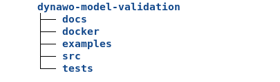
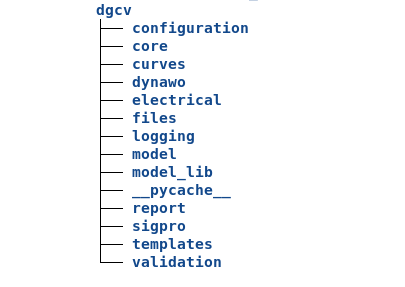

====================================================
Dynamic grid Compliance Verification Developer Guide
====================================================

The purpose of this documents is *not* to provide a detailed explanation of each of the
modules that make up the **Dynamic grid Compliance Verification** tool. Instead, it explains the
design principles and the internal organization of the code, so that a developer can
efficiently navigate through the source code in order to extend and/or modify the tool's
functionalities.

Design principles
=================

The application is written in Python, and built as a Python package that can be
installed with ``pip``.  The build itself uses ``setuptools``, through a modern
configuration that uses the ``pyproject.toml`` (packaging standards PEP 517, 518,
621). Dependencies on other Python packages are kept to the minimum required; see the
``dependencies`` section in the toml file.

The philosophy of the design is to use **templates** as much as possible, using Jinja as
the templating engine. This affects both some Dynawo model files (PAR files, mostly),
as well as the reports, which are written in LaTeX. This allows the application to be
easily extensible, since many changes (such as the report layout) or additions (such as
a new PCS) are easy to perform through changes in the internal configuration files,
without changing the Python code.

Overall project structure
=========================

At the highest level, the **Dynamic grid Compliance Verification** tool is divided into 5 directories:

* ``docs``
    The tool documentation. Contains the manuals (user, developer), written in
    reStructuredText, using the `Sphinx <https://www.sphinx-doc.org>`_ system. To obtain
    the PDF and HTML renderings of these manuals, activate the developer virtual environment
    (see :ref:`development/installation <dev-setup>`) and run ``make latexpdf`` or
    ``make html`` under each subdirectory (``docs/manual/`` or ``docs/manual_dev/``).
    The ``docs`` directory also contains several other stand-alone documents written
    during the development of the tool, which are useful mostly for developers.

* ``installers``
    Contains the scripts and tooling used to build distribution artifacts, generate
    container images, and prepare end-user installation packages for both Linux
    (native and Docker) and Windows (WSL and Docker). This directory is not used
    during normal DyCoV execution.

* ``examples``
    Contains ready-to-run examples for all supported workflows, organized by
    workflow type:

        * ``Model/`` — RMS Model Validation examples (Dynawo models and ProducerCurves).
        * ``Performance/`` — Electric Performance Verification examples (Dynawo models and ProducerCurves).
        * ``GFM/`` — Grid-Forming envelope generation examples.

* ``src``
    Contains the sources of the tool, which are "built" as a Python package using
    setuptools.  See how the build is configured in ``pyproject.toml``.

* ``tests``
    Contains unit tests of the tool.

src structure
=============

The source directory has been organized based on the logical division of internal tasks
that the application should perform:

* ``configuration``
    Contains the code responsible for importing the configuration files and the classes
    that store those values in RAM, so that other parts of the code can query the
    configured value for each key at runtime.

* ``core``  
    Contains the main code of the tool, i.e. the top-level routines that drive the main
    workflow of the application. This workflow is based on determining the tests required
    for the selected verification, obtaining the curves through dynamic simulation and/or
    files, and verifying them.

* ``curves``
    Code responsible for importing and management of the signals files.

* ``dynawo``
    Code responsible for launching the Dynawo simulator for running a given case.

* ``electrical``
    Code for calculating some electrical values needed at runtime (such as the
    generator's Udim, Pmax, etc.) and, most importantly, the **initialization** values
    for Dynawo simulations (see ``initialization_calcs.py`` and the technical note at
    ``docs/initialization/initialization.pdf``).

* ``files``
    Code related to file management, creating new files and/or directories, moving files from one
    location to another, replacing placeholders in files, etc.

* ``logging``
    Logger for message management.

* ``model``
    Contains the model definition based around the concept of the **PCS**, as defined by RTE's
    DTR document. When one translates the tests defined by the DTR PCSs into actual simulations,
    it is observed that the PCSs implicitly define a hierarchy of logical concepts. To reflect
    this hierarchy in unambiguous terms, the following terminology has beed adopted:
    PCS ==> Benchmarks ==> OperatingCondition.

    * **PCS** (as defined by the DTR)

      * **Benchmarks** (e.g. single connexion line vs. multiple; or infinite bus vs. large equivalent gen)

        * **Operating Conditions** (e.g. connection reactance values Xa vs. Xb; or Q=0 vs. Q=Qmax; etc.)

    *PCS*: a PCS is understood to be the set of tests and compliance criteria
    necessary to validate either the producer's model, or the producer plant's electric
    (dynamic) performance.

    *Benchmark*: a PCS defines one or more network-side setups, each with an
    associated event to be tested under dynamic simulation with Dynawo (typically,
    either a fault or a step change in some control). Therefore in this tool a
    "Benchmarks" contains the invariant description of the RTE's side model that will
    be used in the simulation.

    *Operating Condition*: each Benchmarks may define one or more operating conditions under
    which the simulations should be run: PDR voltage, PQ values, initialization
    conditions, event conditions, reactance of the connecting line, etc.

* ``model_lib``
    Contains the internal DYD and PAR files that the tool defines for RTE's side (i.e.,
    the grid model), for each PCS.  Several parameters of the PAR files, most of them
    concerning *initialization*, are templatized and instantiated at runtime using
    Jinja.
    In addition, the subdir ``modelica_models/`` contains as Modelica dynamic models
    that had to be built for some PCSs.

* ``report``
    Code that manages and generates the final reports for the user. Uses Jinja to
    instantiate the ``*.tex`` templates and calls LaTeX for processing them into PDF.

* ``sigpro``
    Code for signal processing on the provided reference curves. It performs conversion
    from EMT signals into RMS, positive sequence signals. It also performs the required
    interpolation, low-pass-filtering, resampling, etc., in order to be able to compare
    two signals.

* ``templates/PCS``
    This is where the DTR document *PCSs* are defined. For the most part, they are
    "ini" files consisting of key-value pairs.  There is also the special case of the
    ``TableInfiniteBus.txt`` used in some PCSs, which defines the voltage and
    frequency changes of an infinite bus, whose values are templatized using Jinja and
    instantiated at run time.

* ``templates/reports``
    Contains the LaTeX templates for the reports corresponding to each *PCS* of the
    DTR document.  The templating system is Jinja.

* ``validation``
    Implementation of the compliance checks defined by each of the DTR document *PCSs*.

Flowchart
=========

Below is the DyCoV flowchart. This diagram is not intended to show all the details of the 
tool, but rather to facilitate understanding of its main flow.

.. image:: figs_structure/flowchart.*
    :scale: 80%
    :alt: Flowchart of the DyCoV tool

.. _devel-guides:

Developer Guides
================

These sections cover various topics in extending Dynamic grid Compliance Verification for various
use-case. They are comprehensive guide to using Dynamic grid Compliance Verification in many contexts
and assume more knowledge of Dynamic grid Compliance Verification.

.. toctree::
   :maxdepth: 3
   :caption: Task-oriented Developer Guides

   development/installation
   development/addpcs
   development/addmodel
   development/GFM_module
   development/configuration
   development/pypowsybl_backend
   development/olf_initialization

API Reference
=============

This documentation is more complete and programmatic in nature; it is a collection of
information that can be quickly referenced. If you would like usecase-driven documentation, see
:ref:`devel-guides`.

.. toctree::
   :maxdepth: 3
   :caption: API Reference

   man/index