# Summary

# IEC standards

The IEC provides several documents for the validation of WT and WP models. The IEC 61400-21 details which real measuraments should be taken, whereas IEC 61400-27-1 and 2 detail how one should compare the models against the gathered measurements.

## IEC 61400-21 - assessment of power quality

The IEC 61400-21 provides a methodology for the testing and assessment of power quality characteristics of grid connected wind turbines. The characteristics considered are the WT specifications, voltage quality, voltage drop response, power control, grid protection, and reconnection time. Out of these, the voltage drop response and power control are the ones selected for model validation in IEC 61400-27-2.

### Response to voltage drops

Several types of voltage drops, enumerated in Fig. @fig-vdrops, shall be evaluated for the WT operating at 0.1$P_n$, 0.3$P_n$ and 0.9$P_n$. The response shall include plots for the active and reactive power, and active and reactive current and oltage.

Optional tests and measurements, such as pitch angle and rotational speed, may also be carried out. 

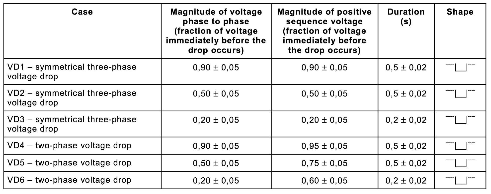{#fig-vdrops}

### Power control

For active power the following quantities are considered:

- Maximum measured power: maximum power produced by the WT averaged over 600, 60, and 0.2 s.
- Ramp rate limitation: power output during operation at a ramp rate value of 10% of rated power value per minute for a period of 10 min.
- Set point control: power regulation when the set point values are adjusted from 100% down to 20% in steps of 20% with 2 min operation at each value.

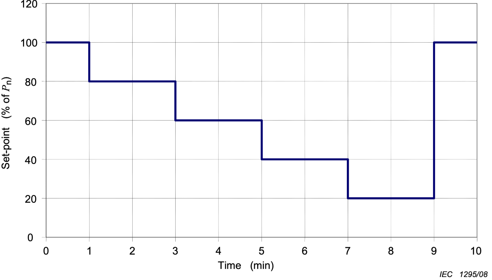{width=50%}

The quantities for reactive power are the same but with different parameters.

### Test procedures

#### General

Section 7.1 - General procedures gives information about the validity of the measurements, required test conditions and equipment. 

- Validity: the measured characteristics are valid only for the specific configuration of the assessed WT. Other configurations, e.g., altered parameters, require separate assessment which can be made by simulation.  
- Conditions: the test setup shall meet several conditions such as limitation on harmonic distortion, voltage deviation, environmental conditions, etc.  
- Equipment: measurement equipment shall be connected according to the diagram below.

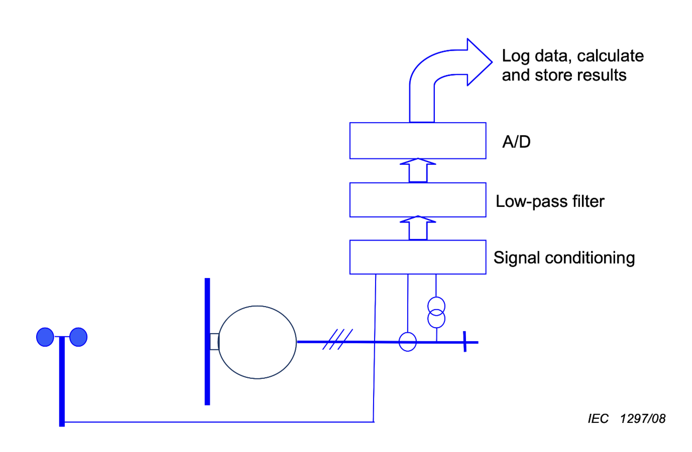{fig-align="center" width=50%}

#### Response to voltage drop

The test can be carried out using for instance a set-up such as the one outlined in the figure below. The voltage drops are created by a short-circuit emulator that connects the three or two phases to ground via an impedance, or connecting the three or two phases together through an impedance.

::: {#fig}
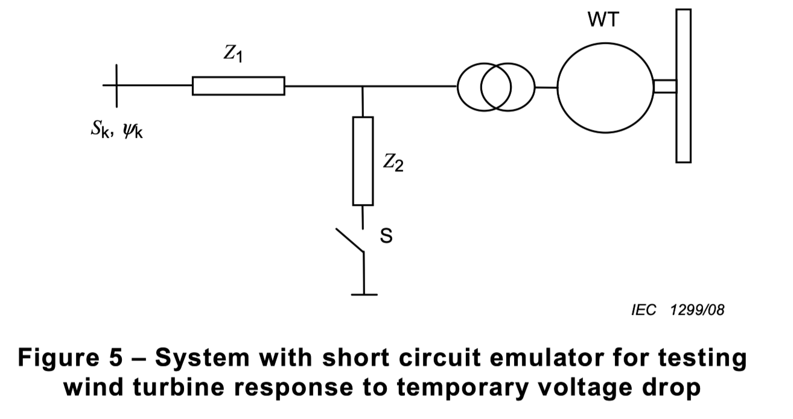{width=60%}
:::

The voltage drop is created by connecting the impedance  Z2 by the switch S. The size of Z2 shall be adjusted to give the voltage magnitudes specified in Table 1 when the wind turbine is not connected. The values of the impedances Z1 and Z2 used in the tests shall be stated in the description of the test equipment

Without the wind turbine connected, the voltage drop shall be within the shape indicated in the figure below.

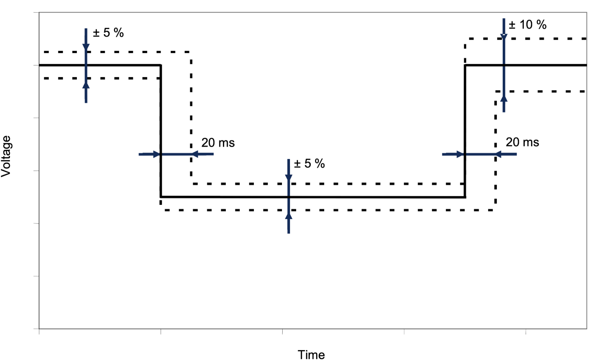{width=60%}

#### Active power

##### Maximum measured power

The maximum measured power shall be measured so that it can be specified in accordance with 6.6.1 as a 600 s average value, P600, a 60 s average value, P60 and as a 0,2 s average value, P0,2 applying the following procedure: 

- Measurements shall be sampled during continuous operation only.  
- The active power shall be measured at the WT terminals.  
- Measurements shall be taken so that at least five 10 min time-series of power are collected for each 1 m/s wind speed bin between cut-in wind speed and 15 m/s.
- $\ldots$

##### Ramp rate limitation

The ramp rate limitation shall be tested so that it can the power output is measured under the following procedure: 

- The wind turbine shall be started from stand still.  
- The ramp rate shall be set to 10 % of rated power per minute.   
- The test shall be carried out until 10 min after the wind turbine has connected to the grid.  
- . . .

##### Set point control
The active power set point control shall be tested under the following procedure:

- The test shall be carried out during a test period of 10 min.  
- Ramp rate limitation shall be deactivated during the test to ensure fastest possible response.  
- The set point signal shall be reduced from 100 % to 20 % in steps of 20 % with 2 min operation at each set point value.  
- . . .

### Report format

Each test case shall fill in the fields in the following forms.

#### Response to voltage drops

Wind turbine operational mode:  (fill in) 

Test conditions: (fill in)

Figure : Time-series of measured voltage drop when the wind turbine under test is not connected. Case VD1-VD6.  

**Test results for operation at between 0,1Pn and 0,3Pn**: 

- Figure : Time-series of measured positive sequence fundamental active power. Case VD1-VD6.  
- Figure : Time-series of measured positive sequence fundamental reactive power. Case VD1-VD6.   
- Figure : Time-series of measured positive sequence fundamental active current. Case VD1-VD6.  
- Figure : Time-series of measured positive sequence fundamental reactive current. Case VD1-VD6.  
- Figure :Time-series of measured positive sequence fundamental voltage at wind turbine terminals. Case VD1-VD6.  

#### Active power

##### Maximum measured power

600s average value:  

- Measured value, $P_{600}$(kW)  
- Normalized value, $p_{600}=P_{600}/P_n$

60s average value:  

- Measured value, $P_{60}$(kW)  
- Normalized value, $p_{60}=P_{600}/P_n$

##### Ramp rate limitation
Wind turbine operational mode: ramp rate limitation set to 10 % of rated power per minute.

- Figure : Time-series of available and measured active power output.  
- Figure : Time-series of measured wind speed during the test.

##### Set point control
Wind turbine operational mode: active power set-point control mode

- Figure : Time-series of active power set-point values, available power and measured active power output.  
- Figure : Time-series of measured wind speed during the test.

## IEC 61400-27-1 Electrical simulation models - wind turbines

IEC 61400-27-1 specifies dynamic simulation models for generic wind turbine topologies. The standard defines the generic terms and parameters with the purpose of specifying the electrical characteristics of a wind turbine at the connection terminals. Furthermore, it includes procedures for validation of the specified simulation models.

The most important sections in the standard are Section 6 - Specification of models, which details how the WT models should be implemented, and Section 7 - Validation specifications, which details how the models should be compared against the measurements taken according to IEC 61400-21-1.

### Specifications of models

Section 6 specifies generic simulation models for the different types of WTs. The covered types are:

- Type 1: WT with direcly connected induction generator with fixed rotor resistance
- Type 2: WT with direcly connected induction generator with variable rotor resistance
- Type 3: WT with doubly-fed asynchronous generators
- Type 4: WT connected fully through a power converter

The standard uses the generic WT structure shown in the figure below. For each WT type, Section 6.4 adapts the generic structure to it and specifies the submodules to be implemented.

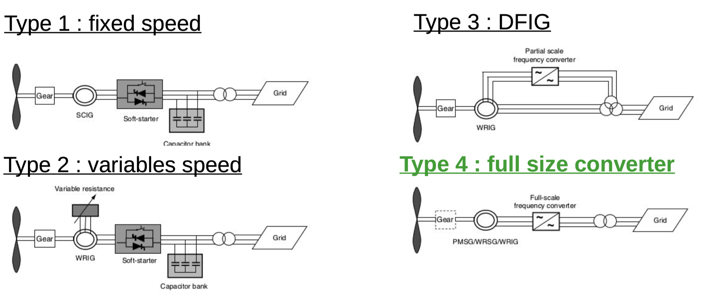
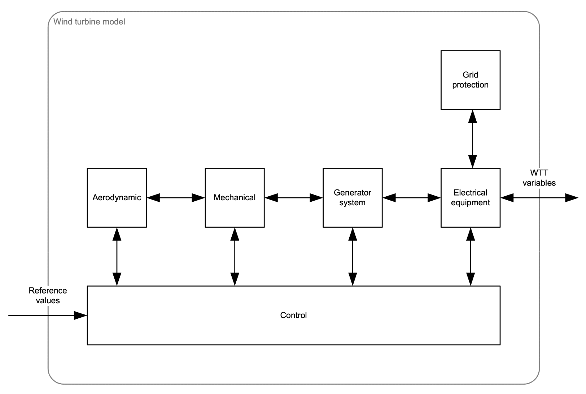{width=85%}

As an example, the specification of the type 1A states that this WT has no FRT control, and that the blade pitch angle is assumed to stay constant during stability simulations. Moreover, the model structure and details for each block are given in the two figures below.

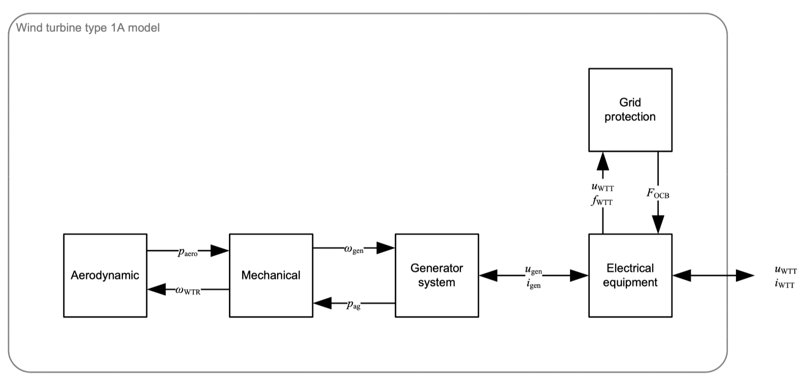
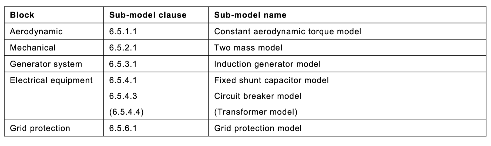

Each submodel clause provides implementation details such as block diagram, required parameters and expected behavior.  Sometimes no details are provided and the standard indicates that the standard model in the simulation tool should be used instead. Let us look for instance at the implementation of the aerodynamic torque model (6.5.1.1) for the Type 1A WT:

::: {#fig}
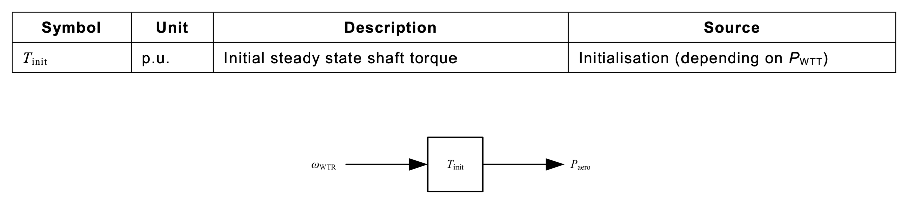
:::

### Validation specifications

Section 7 specifies the standard procedure to validate a wind turbine simulation model against tests on the wind turbine in concern. This validation procedure does not define any tests, or test procedures, but relies solely on 5 the procedures given in IEC 61400-21for such tests. In addition the results of the validation shall be appropriate for quantifying the simulation model accuracy with the purpose of being applied in various grid stability evaluations and planning studies.

The simulation model validation tests shall include at least the following wind turbine functional characteristics:  
- Validation of the simulation model response to voltage drops  
- Validation of the simulation model active power control facilities  
- Validation of the simulation model reactive power control facilities  
- Validation of grid protection

The result of the validation tests is to state / quantify the following characteristics of a simulation model:

- The errors between the measured and the simulated values - described in clause 7.3
- The situations where the simulation model is applicable

::: {#fig}
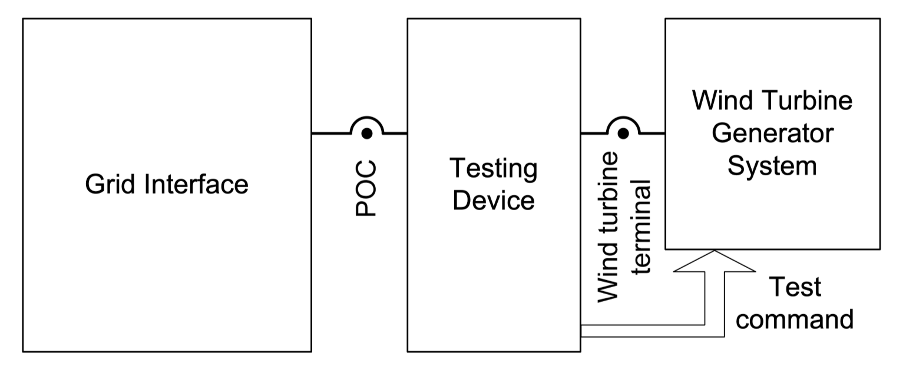{width=70%}
:::

#### Validation of voltage drop

Measurements required for validation of simulation model representing the voltage drop capabilities of a wind turbine are as follows: 

- Voltage acquired as specified in IEC 61400-21, clause 7.1.2; 7.1.3; and 7.5 
- Active and reactive current acquired as specified in IEC 61400-21, clause 7.1.2; 7.1.3; and 7.5 24 
- The active and reactive power calculated as stated in IEC 61400-21 Annex C.

#### Validation of active and reactive power control

Measurements required for validation of the simulation model fitting the active and reactive  power control facilities are as follows: 

- Voltage acquired as specified in IEC 61400-21, clause 7.1.2; 7.1.3; 7.6 and 7.7  
- Active and reactive current acquired as specified in IEC 61400-21, clause 7.1.2; 7.1.3; 7.6 9 and 7.7  
- The active and reactive power calculated as stated in IEC 61400-21 Annex C.

Additionally, the reaction time, rise time and settling time shall be reported and calculated as in B.3.5.

#### Validation of grid protection functionality

Measurements required for validation of the simulation model fitting the active and reactive 6 power control facilities are as follows: 

- Voltage acquired as specified in IEC 61400-21, clause 7.1.2; 7.1.3; 7.6 and 7.7  
- Active and reactive current acquired as specified in IEC 61400-21, clause 7.1.2; 7.1.3; 7.6 9 and 7.7 10  
- The active and reactive power calculated as stated in IEC 61400-21 Annex C.  

#### Error calculations

To provide a comparison of measured values and simulated values, an evaluation of the deviation between the simulated values and the measured values shall be performed for the following variables:

- Active and reactive current p.u.
- Terminal voltage p.u.
- Active power p.u.

In order to ensure an adequate comparison between simulation and measurements, the signals go through a signal processing pipeline as shown below.

::: {#fig}
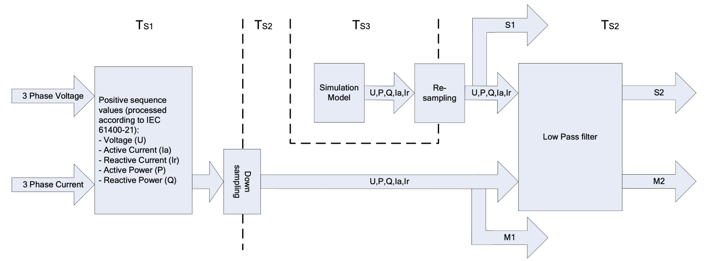
:::

For each variable to be validated, the error signal between the measurement $x_m$ and the simulation $x_s$ is calculated assumed
$$
r_e(n) = x_m - x_s
$$

From this signal, the following quantities shall be calculated and reported:

- Maximum error (MA)  $e_{MA} = \max (|x_e(1)|, |x_e(2)|...)$
- Mean absolute error (MAE) $e_{MAE}= (1/N) \sum^N_{n=1}|x_e(n)|$
- Mean error (ME) $e_{ME}= (1/N) \sum^N_{n=1}x_e(n)$

These values should be calculated over 5 windows as in the table below.

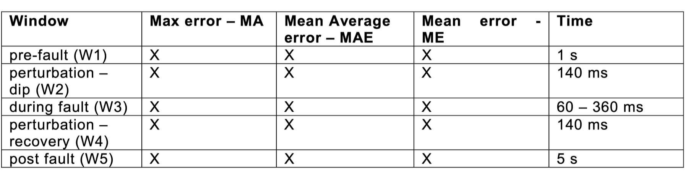

Furthermore, plots showing the absolute error time series should be presented for each of these variables: active power, active current, reactive power and reactive current.

### Validation test reports

Annex A describes the documents to be applied for validation, and gives a format for the reporting of results of test validation.

## IEC 61400-27-2 - model validation

The IEC 614000-27-2 is titled "Wind energy generation systems –  Part 27-2: Electrical simulation models – Model validation" and it specifies procedures for the validation of simulation models of wind turbines and power plants.

