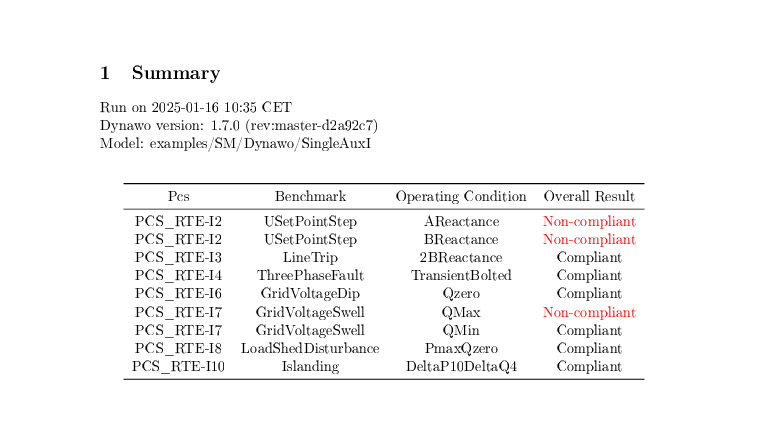
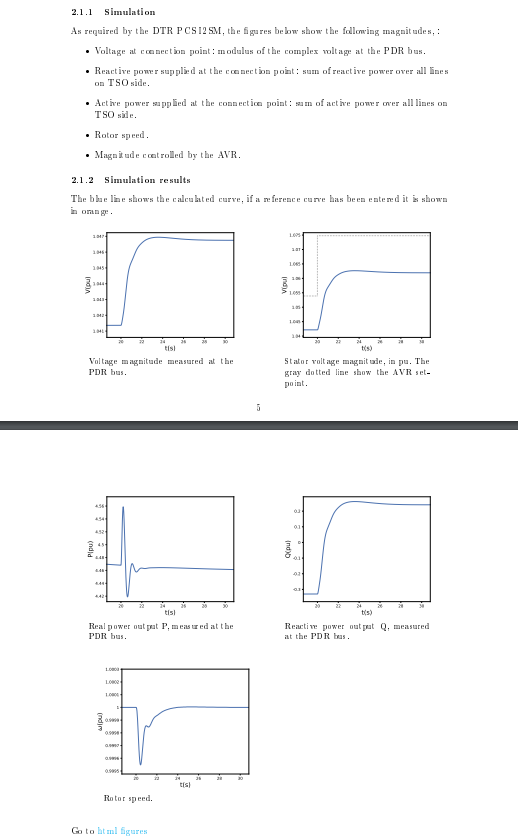
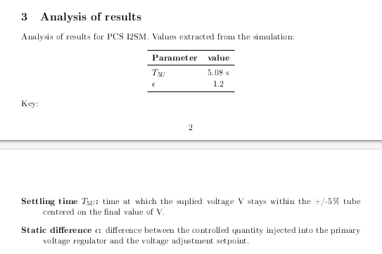
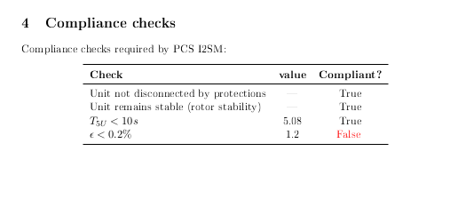
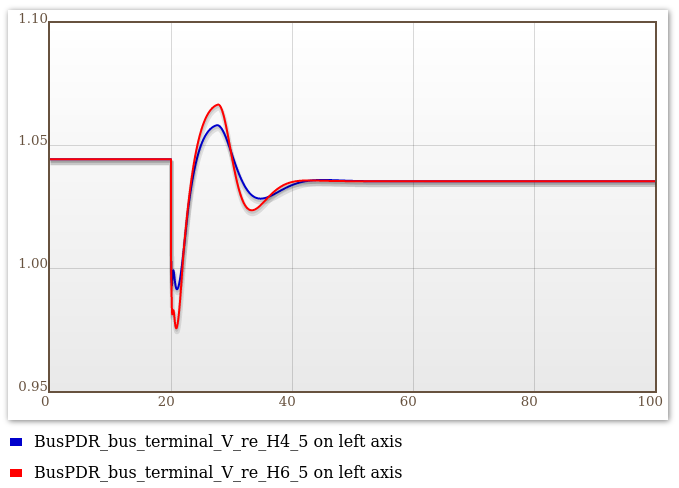

===========================

TUTORIAL

GENERAL USAGE

(c) 2023&mdash;25 RTE  
Developed by Grupo AIA

===========================

--------------------------------------------------------------------------------

#### Table of Contents

1. [First run](#first-run)
   1. [Assumptions](#assumptions)
   2. [Executables](#executables)
   3. [First test](#first-test)
1. [Results directory](#results-directory)
   1. [The structure of results](#the-structure-of-results)
   2. [The structure of a *PCS* output](#the-structure-of-a-pcs-output)
   3. [The structure of results when running with in debug mode (-d)](#the-structure-of-results-when-running-with-in-debug-mode--d)
3. [Configuration](#configuration)
   1. [The structure of the `~/.config/dycov` dir](#the-structure-of-the-configdycov-dir)
4. [Troubleshooting](#troubleshooting)
   1. [Error compiling a dynamic model](#error-compiling-a-dynamic-model)
   2. [Failed Simulation](#failed-simulation)
5. [Extra](#extra)
   1. [Generation of Producer Inputs](#generation-of-producer-inputs)
   2. [Model compilation of custom Dynawo assembled models](#model-compilation-of-custom-dynawo-assembled-models)
   3. [Curves Anonymizer](#curve-anonymizer)

--------------------------------------------------------------------------------

# First run

## Assumptions

For the first run of the tool we will assume that:

* Dynawo v1.7.x (Release) already installed (either globally or via the DyCoV installer)
  ```bash
  user@dynawo:~$ dynawo.sh --version
  1.7.0 (rev:master-311b916)
  ``` 

* DyCoV (DyCoV) Tool already installed.

* DyCoV Environment activated.
  If you installed via the Linux script, use the generated activation script:
  ```bash
  user@dynawo:~/work$ source dycov/activate_dycov
  (dycov_venv) user@dynawo:~/work$
  ``` 

* Fresh start, there is no `~/.config/dycov` created yet
  ```bash
  user@dynawo:~/work$ ls -al ~/.config/dycov
  ls: cannot access '/home/user/.config/dycov': No such file or directory
  ``` 

## Executables

The tool currently has different entry points, at this point we will briefly 
describe each entry point.

### RMS model validation:

In this mode the tool runs a set of *Model Validation tests*. Some of these tests 
resemble those of the *PCS* in the provisional operation notification (ION) stage 
in the RTE's DTR, while some are different.

```bash
(dycov_venv) user@dynawo:~/work$ dycov validate -h
usage: dycov validate [-h] [-d] [-l LAUNCHER_DWO]
                     [-m PRODUCER_MODEL | -c PRODUCER_CURVES] [-p PCS]
                     [-o RESULTS_DIR] [-od]
                     [reference_curves]

positional arguments:
  reference_curves      enter the path to the folder containing the reference
                        curves for the Performance Checking Sheet (PCS)

options:
  -h, --help            show this help message and exit
  -d, --debug           more debug messages
  -l LAUNCHER_DWO, --launcher_dwo LAUNCHER_DWO
                        enter the path to the Dynawo launcher
  -m PRODUCER_MODEL, --producer_model PRODUCER_MODEL
                        enter the path to the folder containing the
                        producer_model files (DYD, PAR, INI)
  -c PRODUCER_CURVES, --producer_curves PRODUCER_CURVES
                        enter the path to the folder containing the curves for
                        the Performance Checking Sheet (PCS)
  -p PCS, --pcs PCS     enter one Performance Checking Sheet (PCS) to validate
  -o RESULTS_DIR, --results_dir RESULTS_DIR
                        enter the path to the results dir
  -od, --only_dtr       validate using only the PCS defined in the DTR
```

### Electric performance verification:

This command can be used with PPM, Stockage or with synchronous machines.
In this mode the tool runs an execution pipeline consisting in a set of pre-defined
tests, those of the *PCS* in the provisional operation notification (ION) stage in 
the RTE's DTR.

```bash
(dycov_venv) user@dynawo:~/work$ dycov performance -h
usage: dycov performance [-h] [-d] [-l LAUNCHER_DWO] [-m PRODUCER_MODEL]
                    [-c PRODUCER_CURVES] [-p PCS] [-o RESULTS_DIR] [-od]

options:
  -h, --help            show this help message and exit
  -d, --debug           more debug messages
  -l LAUNCHER_DWO, --launcher_dwo LAUNCHER_DWO
                        enter the path to the Dynawo launcher
  -m PRODUCER_MODEL, --producer_model PRODUCER_MODEL
                        enter the path to the folder containing the
                        producer_model files (DYD, PAR, INI)
  -c PRODUCER_CURVES, --producer_curves PRODUCER_CURVES
                        enter the path to the folder containing the curves for
                        the Performance Checking Sheet (PCS)
  -p PCS, --pcs PCS     enter one Performance Checking Sheet (PCS) to validate
  -o RESULTS_DIR, --results_dir RESULTS_DIR
                        enter the path to the results dir
  -od, --only_dtr       validate using only the PCS defined in the DTR
```

Note that, in this mode, the tool can perform the electrical performance
verification using either a user-provided dynawo **model** (running Dynawo
simulations), or a set of user-provided **curves**, or both (in which case 
the curves are used only for showing them on the graphs, along the simulated
curves). Therefore, you must provide either a *PRODUCER_MODEL* or a
*PRODUCER_CURVE* directory, or both.

## First test

The easiest way to start using the tool is to copy one or more of the available examples.
(Assuming you are in the directory where `dycov` was installed, usually `$PWD/dycov`):

```bash
(dycov_venv) user@dynawo:~/dycov$ mkdir work/MyTests/
(dycov_venv) user@dynawo:~/dycov$ cd work
(dycov_venv) user@dynawo:~/dycov/work$ cp -a ../examples/SM/Dynawo/* MyTests
(dycov_venv) user@dynawo:~/dycov/work$ tree MyTests
MyTests
├── Single
│   ├── Producer.dyd
│   ├── Producer.ini
│   └── Producer.par
├── SingleAux
│   ├── Producer.dyd
│   ├── Producer.ini
│   └── Producer.par
├── SingleAuxI
│   ├── Producer.dyd
│   ├── Producer.ini
│   └── Producer.par
└── SingleI
    ├── Producer.dyd
    ├── Producer.ini
    └── Producer.par
```

Each entry point to the tool has parameters to customize its execution, below 
are the parameters for the `dycov performance` executable:

```bash
(dycov_venv) user@dynawo:~/dycov/work$ dycov performance -h
usage: dycov performance [-h] [-d] [-l LAUNCHER_DWO] [-m PRODUCER_MODEL] [-c PRODUCER_CURVES] [-p PCS] [-o RESULTS_DIR] [-od]

options:
  -h, --help            show this help message and exit
  -d, --debug           more debug messages
  -l LAUNCHER_DWO, --launcher_dwo LAUNCHER_DWO
                        enter the path to the Dynawo launcher
  -m PRODUCER_MODEL, --producer_model PRODUCER_MODEL
                        enter the path to the folder containing the producer_model files (DYD, PAR, INI)
  -c PRODUCER_CURVES, --producer_curves PRODUCER_CURVES
                        enter the path to the folder containing the curves for the Performance Checking Sheet (PCS)
  -p PCS, --pcs PCS     enter one Performance Checking Sheet (PCS) to validate
  -o RESULTS_DIR, --results_dir RESULTS_DIR
                        enter the path to the results dir
  -od, --only_dtr       validate using only the PCS defined in the DTR
```

* **-h, --help**: 
  Displays the help message with all the configuration parameters available 
  for the selected command.

* **-d, --debug**: 
  This parameter increases the information offered to the user about the execution 
  of the command (it will be described in more detail later).

* **-l, --launcher_dwo**: 
  This parameter allows the user to select the Dynawo executable that will be used 
  to simulate the producer model, if given. If the parameter is ignored, the executable 
  configured by default in the user's PATH will be used. 

* **-m, --producer_model**: 
  Path where the DYD, PAR and INI files that make up the producer's Dynawo model 
  are located. Both this parameter and the producer curves parameter (described below) 
  are optional, but it is mandatory that at least one of the two be present. There 
  are exceptions with certain parameters, whose objective is not to execute validation 
  tests, but rather to get help in using the command or to obtain help in creating its inputs.

* **-c, --producer_curves**: 
  Path where the directory structure with the producer curves are located. Both this 
  parameter and the producer model parameter (described above) are optional, but it
  is mandatory that at least one of the two be present. There are exceptions with
  certain parameters, whose objective is not to execute validation tests, but rather to 
  get help in using the command or to obtain help in creating its inputs.

* **-p, --pcs**: 
  This parameter allows you to limit the tests that will be validated to a single 
  Performance Checking Sheet (*PCS*). 

* **-o, --results_dir**: 
  This parameter allows the user to set the path where the tool will save the 
  execution results. If no specific path is declared for the results, a new *Results* directory will be created in the producer model path, or in the path of the producer
  curves if there is no producer model, to save the results of the execution.

* **-od, --only_dtr**: 
  It allows yo to run the pipeline validating only the PCS defined in the DTR.

  
Note: Regarding the `dycov performance` executable it has exactly the same 
parameters described, while for the `dycov validate` executable the parameters 
**--producer_model** and **--producer_curves** are mandatory, for this reason 
they become positional arguments.


And run one of the copied examples:
* The console displays the current state of the tool execution in messages.
* Once the execution is finished, a final report is automatically 
  opened with the summary of the execution and all the individual reports 
  of the tests carried out.

Note: console output also goes into the logfile, *dycov.log*.

An example of the console output:

```bash
(dycov_venv) user@dynawo:~/dycov/work/MyTests$ dycov performance -m SingleAuxI
2024-02-01 11:56:27,637 | DyCoV.Operating Condition |    INFO | operating_condition.py:585 | RUNNING BENCHMARK: PCS_RTE-I4.ThreePhaseFault, OPER. COND.: TransientBolted
2024-02-01 11:56:40,688 |          DyCoV.PDFLatex |    INFO |            report.py:180 | PDF Done
2024-02-01 11:56:40,744 | DyCoV.Operating Condition |    INFO | operating_condition.py:585 | RUNNING BENCHMARK: PCS_RTE-I10.Islanding, OPER. COND.: DeltaP10DeltaQ4
2024-02-01 11:56:45,994 |          DyCoV.PDFLatex |    INFO |            report.py:180 | PDF Done
2024-02-01 11:56:46,001 | DyCoV.Operating Condition |    INFO | operating_condition.py:585 | RUNNING BENCHMARK: PCS_RTE-I3.LineTrip, OPER. COND.: 2BReactance
2024-02-01 11:56:52,288 |          DyCoV.PDFLatex |    INFO |            report.py:180 | PDF Done
2024-02-01 11:56:52,294 | DyCoV.Operating Condition |    INFO | operating_condition.py:585 | RUNNING BENCHMARK: PCS_RTE-I2.USetPointStep, OPER. COND.: AReactance
2024-02-01 11:56:52,562 | DyCoV.Operating Condition |    INFO | operating_condition.py:585 | RUNNING BENCHMARK: PCS_RTE-I2.USetPointStep, OPER. COND.: BReactance
2024-02-01 11:56:59,087 |          DyCoV.PDFLatex |    INFO |            report.py:180 | PDF Done
2024-02-01 11:56:59,108 | DyCoV.Operating Condition |    INFO | operating_condition.py:585 | RUNNING BENCHMARK: PCS_RTE-I6.GridVoltageDip, OPER. COND.: Qzero
2024-02-01 11:57:04,844 |          DyCoV.PDFLatex |    INFO |            report.py:180 | PDF Done
2024-02-01 11:57:04,850 | DyCoV.Operating Condition |    INFO | operating_condition.py:585 | RUNNING BENCHMARK: PCS_RTE-I7.GridVoltageSwell, OPER. COND.: QMax
2024-02-01 11:57:10,363 |        DyCoV.Validation | WARNING |       performance.py:119 | P has not reached steady state
2024-02-01 11:57:10,440 | DyCoV.Operating Condition |    INFO | operating_condition.py:585 | RUNNING BENCHMARK: PCS_RTE-I7.GridVoltageSwell, OPER. COND.: QMin
2024-02-01 11:57:17,621 |          DyCoV.PDFLatex |    INFO |            report.py:180 | PDF Done
2024-02-01 11:57:17,652 | DyCoV.Operating Condition |    INFO | operating_condition.py:585 | RUNNING BENCHMARK: PCS_RTE-I8.LoadShedDisturbance, OPER. COND.: PmaxQzero
2024-02-01 11:57:23,223 |          DyCoV.PDFLatex |    INFO |            report.py:180 | PDF Done
```

The final report is made up of:

* A brief summary of the result obtained in each test



* And a detailed report of each test


Each detailed report is divided into 4 sections:

* Overview: explanation of the case to be tested


* Simulation: Presentation of the most representative curves for the test.



* Analysis of results: Presentation of the values that are checked to 
  validate the test.



* Compliance checks: Table with the compliance controls that the test 
  must pass to validate the producer's model.




# Results directory

## The structure of results

After executing a verification of the tool, a directory is created where 
the results are saved.

The *Results* directory is structured in:

```
(dycov_venv) user@dynawo:~/dycov/work/MyTests$ tree Results -L 3
Results
├── PCS_RTE-I10
│   └── Islanding
│       └── DeltaP10DeltaQ4
├── PCS_RTE-I2
│   └── USetPointStep
│       ├── AReactance
│       └── BReactance
├── PCS_RTE-I5
│   └── ThreePhaseFault
│       └── TransientBolted
├── PCS_RTE-I6
│   └── GridVoltageDip
│       └── Qzero
├── PCS_RTE-I7
│   └── GridVoltageSwell
│       ├── QMax
│       └── QMin
└── Reports
    ├── report.pdf
    └── HTML
        ├── PCS_RTE-I2.USetPointStep.AReactance.html
        ├── PCS_RTE-I2.USetPointStep.BReactance.html
        ├── PCS_RTE-I5.ThreePhaseFault.TransientBolted.html
        ├── PCS_RTE-I6.GridVoltageDip.Qzero.html
        ├── PCS_RTE-I7.GridVoltageSwell.QMax.html
        └── PCS_RTE-I7.GridVoltageSwell.QMin.html
```

* **Reports/report.pdf**: 
  Complete verification report of the supplied model, the report consists of 
  a summary with the results of the *PCS* carried out, as well as the individual 
  reports of each *PCS*.
* **Reports/HTML folder**: 
  Individual HTML figures of each simulated *PCS* and scenario.
* **PCS_\* Directories**: 
  A directory with the output of each simulated *PCS*.

## The structure of a *PCS* output

Each *PCS* that is used to validate the producer model generates its own 
directory, this directory is made up of 2 types of elements:
  * The first type of element is the individual *PCS* report, the report 
    is a PDF file whose name begins with "report_".
  * The second type of element is a directory for each *benchmark* that 
    makes up the *PCS*, and these directories contains, in turn, a 
    directory for each *operating condition* that makes up the *benchmark*.

The tool provides, in its outputs, all the necessary files to be able to 
execute each *operating condition* individually with the Dynawo simulator.

The *operating condition* directory is structured in:

```
(dycov_venv) user@dynawo:~/dycov/work/MyTests/Results$ tree PCS_RTE-I10/Islanding/DeltaP10DeltaQ4 -L 1
PCS_RTE-I10/Islanding/DeltaP10DeltaQ4
├── curves_calculated.csv
├── curves_reference.csv
├── Omega.dyd
├── Omega.par
├── outputs
├── Producer.dyd
├── Producer.par
├── solvers.par
├── TSOModel.crv
├── TSOModel.dyd
├── TSOModel.jobs
└── TSOModel.par
```

* **TSOModel Files**: 
  Files with the implementation of the *PCS* model for the Dynawo simulator.
* **solvers.par**: 
  File with the parameters used for the solvers that the tool can use.
* **Omega Files**: 
  Definition of the dynamic model used to declare OmegaRed and its parameters.
* **Producer Files**: 
  Definition of the producer model supplied by the user and its parameters.
* **curves_calculated.csv**: 
  File with the curves calculated by the tool for validating the producer's 
  model. It is only available if the Dynawo simulator finishes successfully.
* **curves_reference.csv**: 
  File with the reference curves obtained from user input for validating 
  the producer's model. It is only available as output of the `dycov validate` 
  command.
* **outputs**: 
  Directory with the output generated by the dynamic simulation of the model 
  with Dynawo.

By accessing the directory with the results of an *operating condition* it is possible to experiment by modifying one or more parameters of the 
producer model, and obtain new curves with the Dynawo simulator. In the 
following example, the H parameter ("Kinetic constant = kinetic energy 
/ rated power") of the producer's Synchronous Machine found in the 
Producer.par file is modified, changing its value from 4.5 to 6.5. 

Note: Any edit to the TSOModel files will only have effects for executions 
by the user of the Dynawo simulator; future executions of the tool will 
not be affected by these changes.

```
    <par type="DOUBLE" name="generator_H" value="6.5"/>
```



In order for the tool to validate a change in the parameters of the 
producer model, it is essential to make the changes to the original 
input model files, and run the tool again. In this example, the original 
model is modified with the value of 6.5 in the H parameter of the 
Synchronous Machine, and to avoid losing the results of the first 
verification, an alternative route is indicated for the results of the 
new execution.

```bash
(dycov_venv) user@dynawo:~/dycov/work/MyTests$ dycov performance -m SingleAuxI -o SingleAuxI/Results_H6_5
2024-02-05 15:13:48,978 | DyCoV.Operating Condition |    INFO | operating_condition.py:585 | RUNNING BENCHMARK: PCS_RTE-I4.ThreePhaseFault, OPER. COND.: TransientBolted
2024-02-05 15:14:04,376 |          DyCoV.PDFLatex |    INFO |            report.py:180 | PDF Done
2024-02-05 15:14:04,425 | DyCoV.Operating Condition |    INFO | operating_condition.py:585 | RUNNING BENCHMARK: PCS_RTE-I10.Islanding, OPER. COND.: DeltaP10DeltaQ4
2024-02-05 15:14:10,579 |          DyCoV.PDFLatex |    INFO |            report.py:180 | PDF Done
2024-02-05 15:14:10,599 | DyCoV.Operating Condition |    INFO | operating_condition.py:585 | RUNNING BENCHMARK: PCS_RTE-I3.LineTrip, OPER. COND.: 2BReactance
2024-02-05 15:14:17,239 |          DyCoV.PDFLatex |    INFO |            report.py:180 | PDF Done
2024-02-05 15:14:17,260 | DyCoV.Operating Condition |    INFO | operating_condition.py:585 | RUNNING BENCHMARK: PCS_RTE-I2.USetPointStep, OPER. COND.: AReactance
2024-02-05 15:14:17,572 | DyCoV.Operating Condition |    INFO | operating_condition.py:585 | RUNNING BENCHMARK: PCS_RTE-I2.USetPointStep, OPER. COND.: BReactance
2024-02-05 15:14:24,072 |          DyCoV.PDFLatex |    INFO |            report.py:180 | PDF Done
2024-02-05 15:14:24,092 | DyCoV.Operating Condition |    INFO | operating_condition.py:585 | RUNNING BENCHMARK: PCS_RTE-I6.GridVoltageDip, OPER. COND.: Qzero
2024-02-05 15:14:30,557 |          DyCoV.PDFLatex |    INFO |            report.py:180 | PDF Done
2024-02-05 15:14:30,563 | DyCoV.Operating Condition |    INFO | operating_condition.py:585 | RUNNING BENCHMARK: PCS_RTE-I7.GridVoltageSwell, OPER. COND.: QMax
2024-02-05 15:14:36,391 |        DyCoV.Validation | WARNING |       performance.py:119 | P has not reached steady state
2024-02-05 15:14:36,489 | DyCoV.Operating Condition |    INFO | operating_condition.py:585 | RUNNING BENCHMARK: PCS_RTE-I7.GridVoltageSwell, OPER. COND.: QMin
2024-02-05 15:14:43,436 |          DyCoV.PDFLatex |    INFO |            report.py:180 | PDF Done
2024-02-05 15:14:43,471 | DyCoV.Operating Condition |    INFO | operating_condition.py:585 | RUNNING BENCHMARK: PCS_RTE-I8.LoadShedDisturbance, OPER. COND.: PmaxQzero
2024-02-05 15:14:49,367 |          DyCoV.PDFLatex |    INFO |            report.py:180 | PDF Done
```

Or, if desired, it is possible to validate a *PCS* only

```bash
(dycov_venv) user@dynawo:~/dycov/work/MyTests$ dycov performance -m SingleAuxI -o SingleAuxI/Results_H6_5 -p PCS_RTE-I10
2024-02-05 15:26:10,407 | DyCoV.Operating Condition |    INFO | operating_condition.py:585 | RUNNING BENCHMARK: PCS_RTE-I10.Islanding, OPER. COND.: DeltaP10DeltaQ4
2024-02-05 15:26:16,310 |          DyCoV.PDFLatex |    INFO |            report.py:180 | PDF Done
```

## The structure of results when running with in debug mode (-d)

This section explains the output files generated by the tool when 
a verification is executed in debug mode.

The first and most obvious change is that the log configuration is 
modified to activate debug messages, both in the console and in the 
file.

The changes that apply to the *PCS* output directory:

```bash
(dycov_venv) user@dynawo:~/dycov/work/MyTests$ tree Results_debug/PCS_RTE-I4 -L 3
Results_debug/PCS_RTE-I4
└── ThreePhaseFault
    └── TransientBolted
        ├── curves_calculated.csv
        ├── bisection_last_success
        ├── bisection_last_failure
        ├── Omega.dyd
        ├── Omega.par
        ├── outputs
        ├── Producer.dyd
        ├── Producer.par
        ├── solvers.par
        ├── TSOModel.crv
        ├── TSOModel.dyd
        ├── TSOModel.jobs
        └── TSOModel.par
```

* In PCS that calculate values using a bisection search algorithm, 
* 2 new directories are maintained, each of the new directories 
* containing the complete Dynawo model used in the search, as well 
* as the output of the Dynawo execution. The *bisection_last_success* * directory corresponds to the last simulation that completed 
* successfully, while the *bisection_last_failure* directory 
* corresponds to the last simulation that failed.


# Configuration

## The structure of the `~/.config/dycov` dir

A directory is created after the first run of the tool, it is designed 
both to allow the user to modify the tool configuration 
(`~/.config/dycov/config.ini`). 

The `~/.config/dycov/` directory is structured in:

```
(dycov_venv) user@dynawo:~/.config$ tree dycov
dycov$
├── config.ini
├── config.ini_ADVANCED
├── config.ini_BASIC
├── log
│   └── dycov.log
└── templates
    ├── PCS
    │   ├── model
    │   │   ├── BESS
    │   │   └── PPM
    │   ├── performance
    │   │   ├── BESS
    │   │   ├── PPM
    │   │   └── SM
    │   └── README.md
    ├── README.md
    └── reports
        ├── fig_placeholder.pdf
        ├── model
        │   ├── BESS
        │   └── PPM
        ├── performance
        │   ├── BESS
        │   ├── PPM
        │   ├── SM
        │   └── README.md
        └── TSO_logo.pdf
```

* **config.ini**: 
  File with the tool's user configuration. Setting up the tool is not part 
  of this tutorial, so it will not be covered further.

* **config.ini_ADVANCED and config.ini_BASIC**: 
  This configuration files contain the default values for all configurable 
  variables in the application. To apply basic settings, rename the 
  config.ini_BASIC file to config.ini. If you prefer to use advanced settings, 
  rename the config.ini_ADVANCED file to config.ini instead. The application 
  will then load its configuration from the config.ini file according to the 
  chosen settings.

* **templates**:
  In this path are the user *PCSs* to validate by the tool.

* **templates/PCS**:
  This is where the user *PCSs* are defined. For the most part, they are
  "ini" files consisting of key-value pairs.  There is also the special case of the
  **TableInfiniteBus.txt** used in some PCSs, which defines the voltage and
  frequency changes of an infinite bus, whose values are templatized using Jinja and
  instantiated at run time.

* **templates/reports**:
  Contains the LaTeX templates for the reports corresponding to each *PCS* of the
  user. The templating system is Jinja.


# Troubleshooting

## Failed Simulation

If the final report of the tool shows this result in one or more PCS's, it indicates that 
one of these problems has occurred:

* Dynawo has not been able to perform the requested simulation

* Dynawo has exceeded the maximum timeout established in the simulation of the model

The user can check the reason for the error in the *dycov.log* file left by the tool in the **log** directory inside the user configuration directory.

```
dycov$
├── config.ini
...
├── log
│   ├── dycov.log
...
```

In cases where the simulation has exceeded the maximum configured timeout, a message similar to the 
following will be displayed:

```
2025-01-23 14:19:14,567 |                 DyCoV.Benchmark |       INFO |              benchmark.py:  545 | RUNNING BENCHMARK: PCS_RTE-I16z3.Islanding, OPER. COND.: DeltaP10DeltaQ4
2025-01-23 14:24:14,627 |                    DyCoV.Dynawo |    WARNING |                 dynawo.py:  184 | Execution terminated due to timeout
2025-01-23 14:24:14,668 |                    DyCoV.Dynawo |    WARNING |                 curves.py:  899 | Execution terminated due to timeout
```

In cases where Dynawo has not been able to perform the requested simulation, a message similar to the 
following will be displayed, the message indicates where the log file generated by the Dynawo simulator 
is located:

```
2025-01-23 13:03:55,089 |                 DyCoV.Benchmark |       INFO |              benchmark.py:  545 | RUNNING BENCHMARK: PCS_RTE-I16z3.Islanding, OPER. COND.: DeltaP10DeltaQ4
2025-01-23 13:03:56,192 |                    DyCoV.Dynawo |    WARNING |                 curves.py:  899 | Simulation Fails, logs in IEC2015/PCS_RTE-I16z3/Islanding/DeltaP10DeltaQ4/outputs/logs/dynawo.log
```


# Extra

## Generation of Producer Inputs

It’s an interactive helper tool to aid the user in constructing the 
DYD/PAR/INI files for input to the tool. For now, there is the generate 
option:

```bash
(dycov_venv) user@dynawo:~/dycov/work/repo_dycov$ dycov generate -h
usage: dycov generate [-h] [-d] [-l LAUNCHER_DWO] -o RESULTS_DIR -t {S,S+i,S+Aux,S+Aux+i,M,M+i,M+Aux,M+Aux+i} -v {performance_SM,performance_PPM,model}

options:
  -h, --help            show this help message and exit
  -d, --debug           more debug messages
  -l LAUNCHER_DWO, --launcher_dwo LAUNCHER_DWO
                        enter the path to the Dynawo launcher
  -o RESULTS_DIR, --results_dir RESULTS_DIR
                        enter the path to the results dir
  -t {S,S+i,S+Aux,S+Aux+i,M,M+i,M+Aux,M+Aux+i}, --topology {S,S+i,S+Aux,S+Aux+i,M,M+i,M+Aux,M+Aux+i}
                        enter the desired topology to implement in the DYD file
  -v {performance_SM,performance_PPM,model}, --validation {performance_SM,performance_PPM,model}
                        enter the validation type
```

## Curves Anonymizer

In this mode the tool generates a set of curves with generic names from 
the input curves to which a noise signal is added.

```bash
(dycov_venv) user@dynawo:~/dycov/work/repo_dycov$ dycov anonymize -h
usage: dycov anonymize [-h] [-d] [-c PRODUCER_CURVES] [-o RESULTS_DIR]
	                      [-n NOISESTD] [-f FREQUENCY]
	
optional arguments:
  -h, --help            show this help message and exit
  -d, --debug           more debug messages
  -c PRODUCER_CURVES, --producer_curves PRODUCER_CURVES
	                        enter the path to the folder containing the curves for
	                        the Performance Checking Sheet (PCS)
  -o RESULTS_DIR, --results_dir RESULTS_DIR
                        enter the path to the results dir
  -n NOISESTD, --noisestd NOISESTD
                        enter the standard deviation used to to anonymize the
                        curves (recommended value: [0.01, 0.1])
  -f FREQUENCY, --frequency FREQUENCY
                        enter the frequency used for the lowpass filter
```