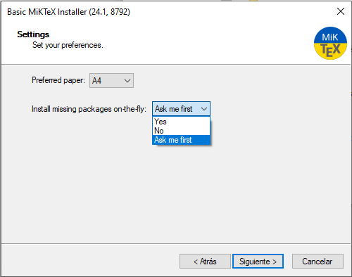

===========================

TUTORIAL

INSTALLATION LINUX

(c) 2023&mdash;24 RTE  
Developed by Grupo AIA

===========================

--------------------------------------------------------------------------------

# Installing Dynamic Grid Compliance Verification

## Table of Contents

1. [Overview](#Overview)
2. [Install Dynawo](#Install-Dynawo)
3. [System Requirements](#System-Requirements)
4. [Install the tool](#Install-the-tool)

## Overview

Dynamic Grid Compliance Verification is developed in `Python` and requires 
**Python 3.9+**. It relies on several third-party libraries which will be 
automatically installed along with the tool.

## Install Dynawo
The first requirement to use the tool is to have Dynawo installed on your computer. 
To do so, follow the steps provided in the [official software repository](https://github.com/dynawo/dynawo) or 
on the [official page](https://dynawo.github.io/install/).

For optimal functionality of the package, Dynawo version v1.7.0 or later is required, 
which should be obtained from the **nightly** builds of the official repository 
(currently, as of September 2024, only available as a [Nightly release](https://github.com/dynawo/dynawo/releases)).

This must be the version with Open Modelica integrated.

It's important to remember that Dynawo requires a series of dependencies:
* Visual Studio 2019
* CMake (minimum version 3.9.6)
* Python2 or Python3

Finally, to verify that Dynawo has been installed correctly, you can use the following 
command:

```bash
dynawo.sh --version
```

## System Requirements

The requirements at the OS-level are rather minimal: one just needs a recent Windows
distribution in which you should install a few packages, **LaTeX**, and **Python**. If
you do not have any strong preference, we would recommend Windows 10 or higher. 

To be more specific, we explicitly list here the packages to be installed:

* **Install Dynawo** (v1.7.0 or later) and its necessary dependencies (previous step)

* **Install these LaTeX packages**:
   LaTeX is used for document processing. You can choose between two LaTeX distributions:
   - **MiKTeX**: Download it from `MiKTeX Download <https://miktex.org/download>`.
   - **TeX Live**: Download it from `TeX Live Download <https://www.tug.org/texlive/>`.

* **Install a basic Python installation** (version 3.9 or higher), containing at least `pip` and the `venv` module:
   - Go to the `official Python website <https://www.python.org/downloads/>`_.
   - Download the latest version of Python 3 (ensure that you select the option to add Python to the system PATH during installation).
   - To verify the installation, open a terminal and run:

Note that the tool itself is also a Python package. However, this package and
all of its dependencies (NumPy, etc.) will get installed under a 
*Python virtual environment*.

## Installation

1. Download the [`DGCV's Windows Installer`](https://github.com/dynawo/dyn-grid-compliance-verification/releases/download/v0.6.0/DGCV_win_Installer.exe).


2. Next, execute the downloaded installer:

   This executable will install the DGCV tool, together with a matching version of Dynawo,
   under the selected directory (default installation path: `c:/dgcv`).  It will do this 
   by copying the latest stable version and compiling and installing the application (and 
   all its dependencies, such as NumPy, etc.) into a Python virtual environment. The 
   installer will also install any third-party applications required for the proper 
   functioning of the tool.


   Note that the MikTex installer allows you to select the configuration that you want to apply. 
   For the tool to work correctly, you must select the "Yes" or "Ask me first" option on the 
   following screen:
   


3. Next, you must activate the virtual environment that has just been created by double-clicking on the DGCV.bat file that has been created on the desktop.

    This action will open a new Command Prompt with the virtual environment activated where the tool can be used.
    To finish using the tool, you only need to close the Command Prompt.

4. The tool is used via a single command dgcv having several subcommands. Quickly check that your installation is working by running the help option, which will show you all available subcommands:

    ```console
       dgcv -h
    ```

5. Upon the first use, the tool will automatically compile the Modelica models internally defined by the tool. You can also run this command explicitly, as follows:

    ```console
       dgcv compile
    ```

## Build and install (for developers)

* **Clone the Repository**
   The first step is to clone the repository to your local machine. Using GitHub Desktop:
   - Open GitHub Desktop and click **File** > **Clone repository**.
   - Enter the following URL to clone the repository:
         
   ```console
     git clone https://github.com/dynawo/dyn-grid-compliance-verification dgcv_repo
   ```
     
   (You may of course use any name for the top-level directory, here "dgcv_repo")

   - Choose a local directory where you want to save the repository and click **Clone**.

* **Set Up Virtual Environment**
   A virtual environment is recommended to manage dependencies for the project. This ensures that the package uses the correct Python version and dependencies without affecting other projects on your system.
   - Open a **CMD terminal** (Command Prompt) as administrator.
   - Navigate to the root folder of the cloned repository using the `cd` command:
         
   ```console
     cd dgcv_repo
   ```
   - Create a new virtual environment with:
         
   ```console
     python.exe -m venv dgcv_venv
   ```

   - This will create a directory `dgcv_venv` in your repository folder.
   
* **Build the Package**
   The next step is to compile the package into a distributable format:
       
   ```console
   	python.exe -m build
   ```

   - This command will create the necessary build files in the `dist` folder of the repository. The build process might take a few minutes to complete.

* **Activate the Virtual Environment**
   Now that the virtual environment is created, activate it to use the isolated environment:
       
   ```console
   	dgcv_venv\Scripts\activate
   ```

   - Once activated, your terminal prompt should change to indicate that the virtual environment is active (e.g., `(dgcv_venv)` at the beginning of the prompt).

* **Install the Package**
   Once the package is built, you can install it using pip. Use the following command to install the `.whl` (Wheel) file generated during the build:
       
   ```console
   	python.exe -m pip install dist\dgcv....whl
   ```

   - This will install the package into your active virtual environment.

* **Verify Installation**
   After installation, verify that the tool was installed correctly by running the following command:
       
   ```console
   	dgcv -h
   ```

   - This should display the help message for the `dyn-grid-compliance-verification` tool, confirming that the installation was successful.

* **Pre-Execution Compilation**
   Before running the tool for the first time, it's recommended to compile the tool's resources:
       
   ```console
   	dgcv compile
   ```
      
   - This step ensures that all necessary files are generated and compiled for optimal performance.
