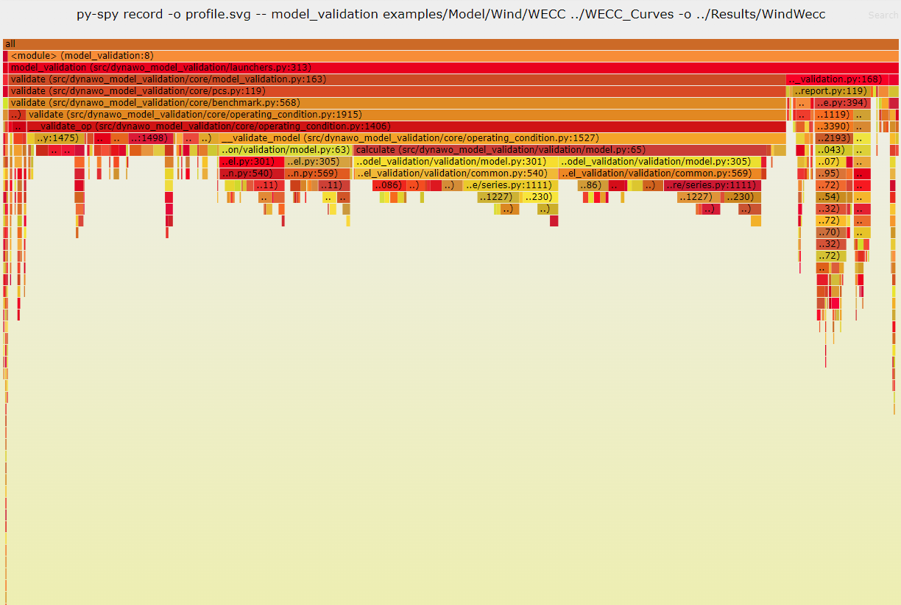
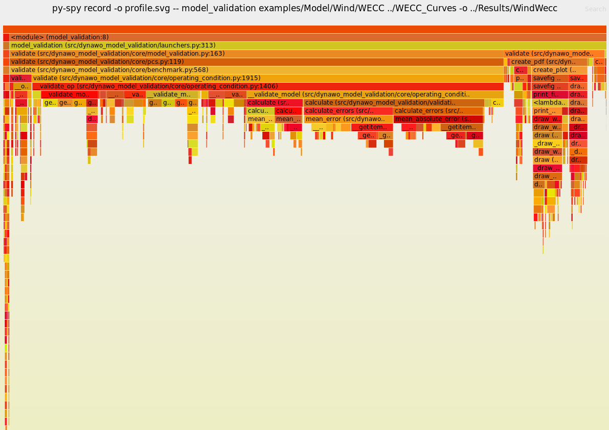

# PERFORMANCE

A performance test of the tool is carried out using the py-spy package. 

## Py-Spy

py-spy is a sampling profiler for Python programs. It lets you visualize what your 
Python program is spending time on without restarting the program or modifying the 
code in any way. py-spy is extremely low overhead: it is written in Rust for speed 
and doesn't run in the same process as the profiled Python program. This means py-spy 
is safe to use against production Python code.

## Initial conditions

For this test, the **model_validation** command is executed using the model and the
reference curves available in *examples/Model/Wind/WECCA/* as inputs.

```
py-spy record -o profile.svg -- dycov validate examples/Model/Wind/WECCA/ReferenceCurves -m examples/Model/Wind/WECCA/Dynawo -o ../Results/Model/Wind/WECCA
```

## Results

The result obtained, visible in the attached image, is a reasonable consumption of the 
tool in all the sections into which a model analysis is divided.



## Potential improvement

As expected, the point with the greatest consumption of execution time is in the 
verification of the compliance checks, and in the calculation of the errors (ME, MAE, MXE) 
of the curves, so it follows that minimizing the number of curves used in the error 
calculations, there will be a decrease in the overall execution time.

## Improvement Results

The results obtained are very similar to the result before the improvement. Although 
in this case, the execution time gain is estimated at 40%.



## Conclusions

Both the tool consumption values and the execution times are considered adequate. It must 
be taken into account that the execution time may vary depending on the model entered by 
the user, there being cases where the parameterization of the model causes Dynawo to require 
more time than usual to carry out its simulations.
